# VLSI Project

- by Aditya Nair
- 2020102022

## Proposed structure for adder

The proposed structure for the adder uses $G_i$ which is known as the carry generate, and $P_i$ which is known as the carry propagate. Here, $G_i$ gives carry 1 when both $A_i$ and $B_i$ are 1 regardless of input carry. $P_i$ determines whether the carry gets transferred to the consequent stage . A diagram for it looks like the following:

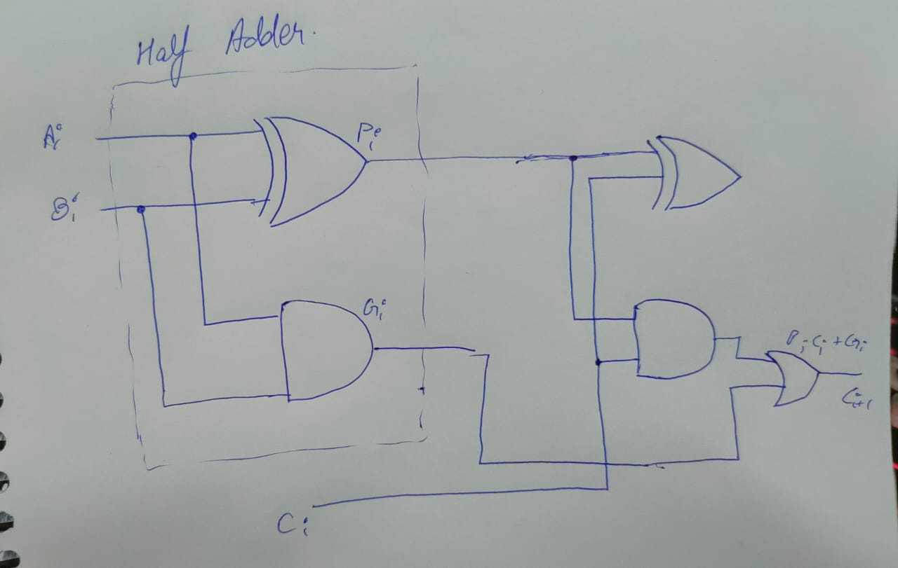

The final diagram in terms of logic gates is as follows:

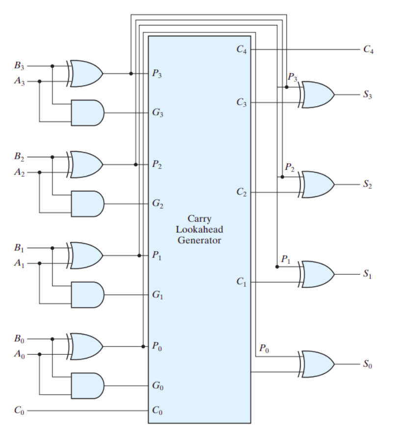

## Design details

### P and G (propagate and generate) block

Here, $P_i = A⊕B$ (XOR gate) and $G_i = A_i \cdot B_i$

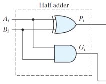

### Carry-lookahead block

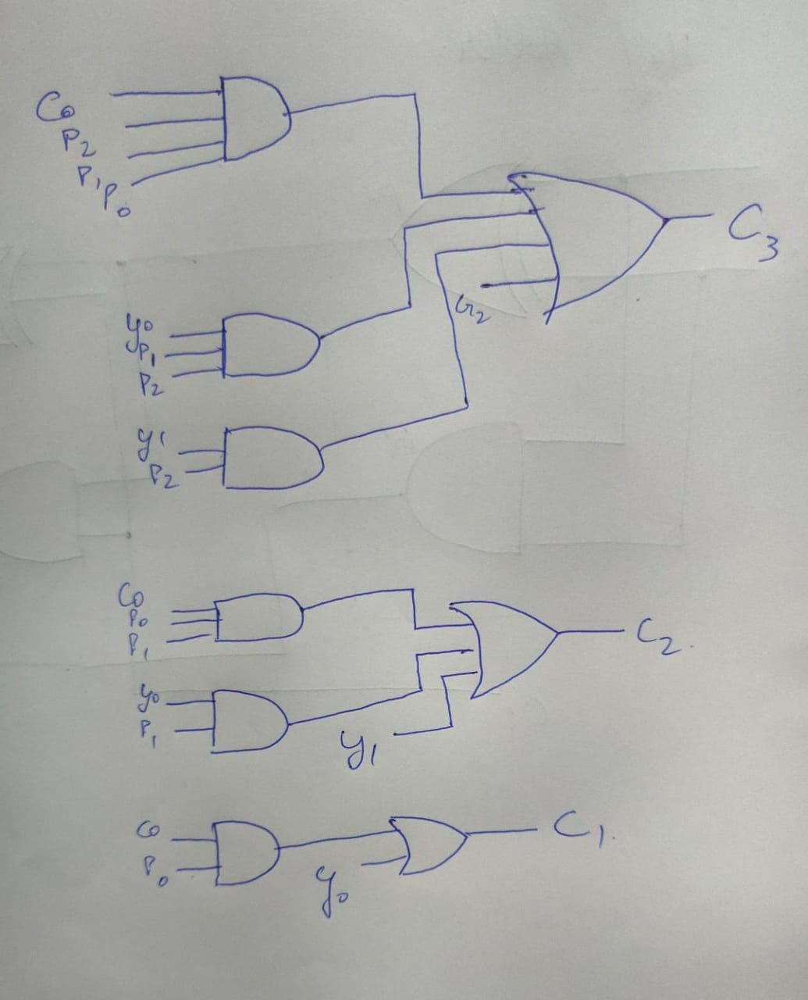

### Sum block

This basically consists of XOR gate, where $S_i = P_i ⊕ C_i$.

- For a NAND/NOR gate, MOSFETS = 4
- For an inverter, MOSFETS = 2
- For an XOR, MOSFETS = 8

## Simulation of blocks in NGSPICE

### Gates
#### 2-input AND gate

```SPICE
.subckt AND2 A B E

.include TSMC_180nm.txt
.include NOT_SUB.sub

.param LAMBDA = 0.18u
.param width_N = {10*LAMBDA}
.param width_P = {2.5*width_N}

vdd vdd gnd 2.0V

M1 C A vdd vdd CMOSP W={width_P} L={LAMBDA}
+ AS = {5*width_P*LAMBDA} PS = {10*LAMBDA + 2*width_P} AD = {5*width_P*LAMBDA} PD = {10*LAMBDA + 2*width_P}

M2 C B vdd vdd CMOSP W={width_P} L={LAMBDA}
+ AS = {5*width_P*LAMBDA} PS = {10*LAMBDA + 2*width_P} AD = {5*width_P*LAMBDA} PD = {10*LAMBDA + 2*width_P}

M3 C B D D CMOSN W={width_N} L={LAMBDA}
+ AS = {5*width_N*LAMBDA} PS = {10*LAMBDA + 2*width_N} AD = {5*width_N*LAMBDA} PD = {10*LAMBDA + 2*width_N}

M4 D A gnd gnd CMOSN W={width_N} L={LAMBDA}
+ AS = {5*width_N*LAMBDA} PS = {10*LAMBDA + 2*width_N} AD = {5*width_N*LAMBDA} PD = {10*LAMBDA + 2*width_N}

xG1 C E NOTNOT

.ends
```

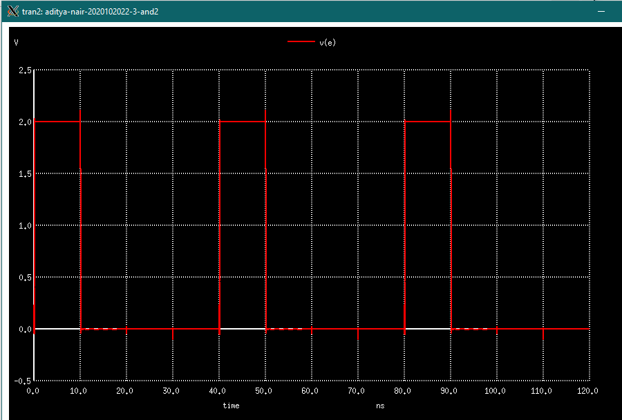

#### 3-input AND gate

```SPICE
.subckt AND3 A B C E

.include TSMC_180nm.txt
.include NOT_SUB.sub

.param LAMBDA = 0.18u
.param width_N = {10*LAMBDA}
.param width_P = {2.5*width_N}

vdd vdd gnd 2.0V

* PMOS part
M1 D A vdd vdd CMOSP W={width_P} L={LAMBDA}
+ AS = {5*width_P*LAMBDA} PS = {10*LAMBDA + 2*width_P} AD = {5*width_P*LAMBDA} PD = {10*LAMBDA + 2*width_P}

M2 D B vdd vdd CMOSP W={width_P} L={LAMBDA}
+ AS = {5*width_P*LAMBDA} PS = {10*LAMBDA + 2*width_P} AD = {5*width_P*LAMBDA} PD = {10*LAMBDA + 2*width_P}

M3 D C vdd vdd CMOSP W={width_P} L={LAMBDA}
+ AS = {5*width_P*LAMBDA} PS = {10*LAMBDA + 2*width_P} AD = {5*width_P*LAMBDA} PD = {10*LAMBDA + 2*width_P}


* NMOS part
M4 D A x1 x1 CMOSN W={width_N} L={LAMBDA}
+ AS = {5*width_N*LAMBDA} PS = {10*LAMBDA + 2*width_N} AD = {5*width_N*LAMBDA} PD = {10*LAMBDA + 2*width_N}

M5 x1 B x2 x2 CMOSN W={width_N} L={LAMBDA}
+ AS = {5*width_N*LAMBDA} PS = {10*LAMBDA + 2*width_N} AD = {5*width_N*LAMBDA} PD = {10*LAMBDA + 2*width_N}

M6 x2 C gnd gnd CMOSN W={width_N} L={LAMBDA}
+ AS = {5*width_N*LAMBDA} PS = {10*LAMBDA + 2*width_N} AD = {5*width_N*LAMBDA} PD = {10*LAMBDA + 2*width_N}

xG1 D E NOTNOT

.ends
```

Plot will be same as 2 input AND gate.

####  4-input AND gate

```SPICE
.subckt AND4 A B C D F

.include TSMC_180nm.txt
.include NOT_SUB.sub

.param LAMBDA = 0.18u
.param width_N = {10*LAMBDA}
.param width_P = {2.5*width_N}

vdd vdd gnd 2.0V

* PMOS part
M1 E A vdd vdd CMOSP W={width_P} L={LAMBDA}
+ AS = {5*width_P*LAMBDA} PS = {10*LAMBDA + 2*width_P} AD = {5*width_P*LAMBDA} PD = {10*LAMBDA + 2*width_P}

M2 E B vdd vdd CMOSP W={width_P} L={LAMBDA}
+ AS = {5*width_P*LAMBDA} PS = {10*LAMBDA + 2*width_P} AD = {5*width_P*LAMBDA} PD = {10*LAMBDA + 2*width_P}

M3 E C vdd vdd CMOSP W={width_P} L={LAMBDA}
+ AS = {5*width_P*LAMBDA} PS = {10*LAMBDA + 2*width_P} AD = {5*width_P*LAMBDA} PD = {10*LAMBDA + 2*width_P}

M4 E D vdd vdd CMOSP W={width_P} L={LAMBDA}
+ AS = {5*width_P*LAMBDA} PS = {10*LAMBDA + 2*width_P} AD = {5*width_P*LAMBDA} PD = {10*LAMBDA + 2*width_P}


* NMOS part
M5 E A x1 x1 CMOSN W={width_N} L={LAMBDA}
+ AS = {5*width_N*LAMBDA} PS = {10*LAMBDA + 2*width_N} AD = {5*width_N*LAMBDA} PD = {10*LAMBDA + 2*width_N}

M6 x1 B x2 x2 CMOSN W={width_N} L={LAMBDA}
+ AS = {5*width_N*LAMBDA} PS = {10*LAMBDA + 2*width_N} AD = {5*width_N*LAMBDA} PD = {10*LAMBDA + 2*width_N}

M7 x2 C x3 x3 CMOSN W={width_N} L={LAMBDA}
+ AS = {5*width_N*LAMBDA} PS = {10*LAMBDA + 2*width_N} AD = {5*width_N*LAMBDA} PD = {10*LAMBDA + 2*width_N}

M8 x3 D gnd gnd CMOSN W={width_N} L={LAMBDA}
+ AS = {5*width_N*LAMBDA} PS = {10*LAMBDA + 2*width_N} AD = {5*width_N*LAMBDA} PD = {10*LAMBDA + 2*width_N}

xG1 E F NOTNOT

.ends
```

#### 5-input AND gate

```SPICE
.subckt AND5 A B C D E G

.include TSMC_180nm.txt
.include NOT_SUB.sub

.param LAMBDA = 0.18u
.param width_N = {10*LAMBDA}
.param width_P = {2.5*width_N}

vdd vdd gnd 2.0V

* PMOS part
M1 F A vdd vdd CMOSP W={width_P} L={LAMBDA}
+ AS = {5*width_P*LAMBDA} PS = {10*LAMBDA + 2*width_P} AD = {5*width_P*LAMBDA} PD = {10*LAMBDA + 2*width_P}

M2 F B vdd vdd CMOSP W={width_P} L={LAMBDA}
+ AS = {5*width_P*LAMBDA} PS = {10*LAMBDA + 2*width_P} AD = {5*width_P*LAMBDA} PD = {10*LAMBDA + 2*width_P}

M3 F C vdd vdd CMOSP W={width_P} L={LAMBDA}
+ AS = {5*width_P*LAMBDA} PS = {10*LAMBDA + 2*width_P} AD = {5*width_P*LAMBDA} PD = {10*LAMBDA + 2*width_P}

M4 F D vdd vdd CMOSP W={width_P} L={LAMBDA}
+ AS = {5*width_P*LAMBDA} PS = {10*LAMBDA + 2*width_P} AD = {5*width_P*LAMBDA} PD = {10*LAMBDA + 2*width_P}

M5 F E vdd vdd CMOSP W={width_P} L={LAMBDA}
+ AS = {5*width_P*LAMBDA} PS = {10*LAMBDA + 2*width_P} AD = {5*width_P*LAMBDA} PD = {10*LAMBDA + 2*width_P}


* NMOS part
M6 F A x1 x1 CMOSN W={width_N} L={LAMBDA}
+ AS = {5*width_N*LAMBDA} PS = {10*LAMBDA + 2*width_N} AD = {5*width_N*LAMBDA} PD = {10*LAMBDA + 2*width_N}

M7 x1 B x2 x2 CMOSN W={width_N} L={LAMBDA}
+ AS = {5*width_N*LAMBDA} PS = {10*LAMBDA + 2*width_N} AD = {5*width_N*LAMBDA} PD = {10*LAMBDA + 2*width_N}

M8 x2 C x3 x3 CMOSN W={width_N} L={LAMBDA}
+ AS = {5*width_N*LAMBDA} PS = {10*LAMBDA + 2*width_N} AD = {5*width_N*LAMBDA} PD = {10*LAMBDA + 2*width_N}

M9 x3 D x4 x4 CMOSN W={width_N} L={LAMBDA}
+ AS = {5*width_N*LAMBDA} PS = {10*LAMBDA + 2*width_N} AD = {5*width_N*LAMBDA} PD = {10*LAMBDA + 2*width_N}

M10 x4 E gnd gnd CMOSN W={width_N} L={LAMBDA}
+ AS = {5*width_N*LAMBDA} PS = {10*LAMBDA + 2*width_N} AD = {5*width_N*LAMBDA} PD = {10*LAMBDA + 2*width_N}

xG1 F G NOTNOT

.ends
```

#### NOT gate

```SPICE
.subckt NOTNOT A B


.include TSMC_180nm.txt

.param LAMBDA = 0.18u
.param width_N = {10*LAMBDA}
.param width_P = {2.5*width_N}

vdd vdd gnd 2.0V

M1 B A vdd vdd CMOSP W={width_P} L={LAMBDA}
+ AS = {5*width_P*LAMBDA} PS = {10*LAMBDA + 2*width_P} AD = {5*width_P*LAMBDA} PD = {10*LAMBDA + 2*width_P}

M2 B A gnd gnd CMOSN W={width_N} L={LAMBDA}
+ AS = {5*width_N*LAMBDA} PS = {10*LAMBDA + 2*width_N} AD = {5*width_N*LAMBDA} PD = {10*LAMBDA + 2*width_N}

.ends
```
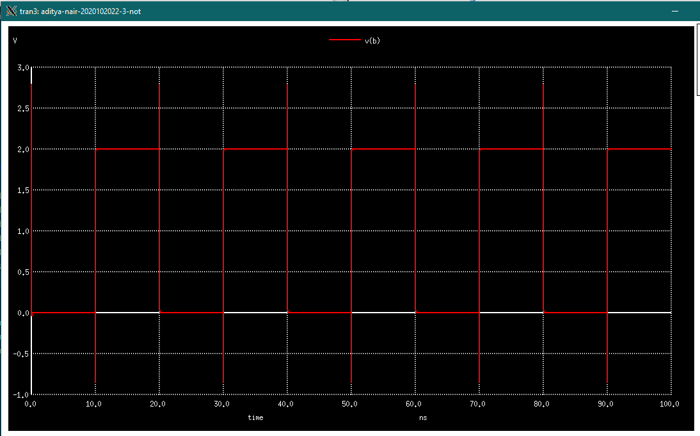

#### OR gate

```SPICE
.subckt OR A B E

.include TSMC_180nm.txt
.include NOT_SUB.sub

.param LAMBDA = 0.18u
.param width_N = {10*LAMBDA}
.param width_P = {2.5*width_N}

vdd vdd gnd 2.0V

M1 D A vdd vdd CMOSP W={width_P} L={LAMBDA}
+ AS = {5*width_P*LAMBDA} PS = {10*LAMBDA + 2*width_P} AD = {5*width_P*LAMBDA} PD = {10*LAMBDA + 2*width_P}

M2 C B D D CMOSP W={width_P} L={LAMBDA}
+ AS = {5*width_P*LAMBDA} PS = {10*LAMBDA + 2*width_P} AD = {5*width_P*LAMBDA} PD = {10*LAMBDA + 2*width_P}

M3 C A gnd gnd CMOSN W={width_N} L={LAMBDA}
+ AS = {5*width_N*LAMBDA} PS = {10*LAMBDA + 2*width_N} AD = {5*width_N*LAMBDA} PD = {10*LAMBDA + 2*width_N}

M4 C B gnd gnd CMOSN W={width_N} L={LAMBDA}
+ AS = {5*width_N*LAMBDA} PS = {10*LAMBDA + 2*width_N} AD = {5*width_N*LAMBDA} PD = {10*LAMBDA + 2*width_N}

xG1 C E NOTNOT

.ends
```

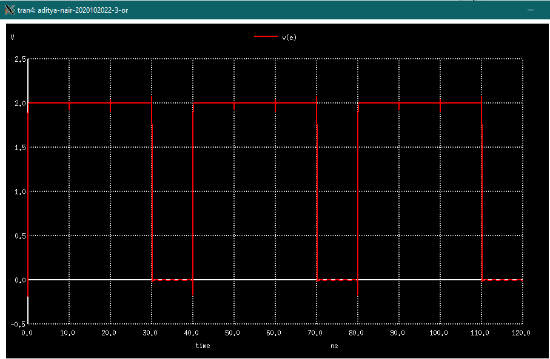

#### XOR gate

```SPICE
.subckt XOR A B R

.include TSMC_180nm.txt
.include NOT_SUB.sub

.param LAMBDA = 0.18u
.param width_N = {10*LAMBDA}
.param width_P = {2.5*width_N}

vdd vdd gnd 2.0V

xG1 A C NOTNOT
xG2 B D NOTNOT

M1 x1 C vdd vdd CMOSP W={width_P} L={LAMBDA}
+ AS = {5*width_P*LAMBDA} PS = {10*LAMBDA + 2*width_P} AD = {5*width_P*LAMBDA} PD = {10*LAMBDA + 2*width_P}

M2 R B x1 x1 CMOSP W={width_P} L={LAMBDA}
+ AS = {5*width_P*LAMBDA} PS = {10*LAMBDA + 2*width_P} AD = {5*width_P*LAMBDA} PD = {10*LAMBDA + 2*width_P}

M3 x2 A vdd vdd CMOSP W={width_P} L={LAMBDA}
+ AS = {5*width_P*LAMBDA} PS = {10*LAMBDA + 2*width_P} AD = {5*width_P*LAMBDA} PD = {10*LAMBDA + 2*width_P}

M4 R D x2 x2 CMOSP W={width_P} L={LAMBDA}
+ AS = {5*width_P*LAMBDA} PS = {10*LAMBDA + 2*width_P} AD = {5*width_P*LAMBDA} PD = {10*LAMBDA + 2*width_P}


M5 R A x3 x3 CMOSN W={width_N} L={LAMBDA}
+ AS = {5*width_N*LAMBDA} PS = {10*LAMBDA + 2*width_N} AD = {5*width_N*LAMBDA} PD = {10*LAMBDA + 2*width_N}

M6 x3 B gnd gnd CMOSN W={width_N} L={LAMBDA}
+ AS = {5*width_N*LAMBDA} PS = {10*LAMBDA + 2*width_N} AD = {5*width_N*LAMBDA} PD = {10*LAMBDA + 2*width_N}

M7 R C x4 x4 CMOSN W={width_N} L={LAMBDA}
+ AS = {5*width_N*LAMBDA} PS = {10*LAMBDA + 2*width_N} AD = {5*width_N*LAMBDA} PD = {10*LAMBDA + 2*width_N}

M8 x4 D gnd gnd CMOSN W={width_N} L={LAMBDA}
+ AS = {5*width_N*LAMBDA} PS = {10*LAMBDA + 2*width_N} AD = {5*width_N*LAMBDA} PD = {10*LAMBDA + 2*width_N}


.ends
```
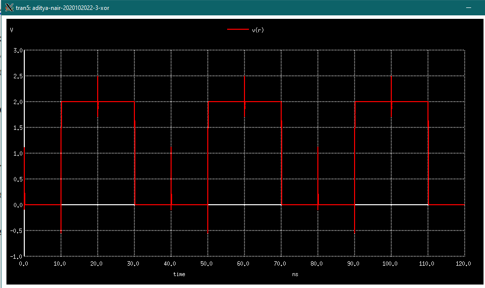

### Blocks

#### Propagate and Generate block
```SPICE
.subckt PROP_GEN A0 B0 A1 B1 A2 B2 A3 B3 P0 G0 P1 G1 P2 G2 P3 G3

.include TSMC_180nm.txt
.include NOT_SUB.sub
.include AND2.sub
.include AND3.sub
.include AND4.sub
.include AND5.sub
.include XOR.sub
.include OR.sub

.param LAMBDA = 0.18u
.param width_N = {10*LAMBDA}
.param width_P = {2.5*width_N}

* Defining the inputs
vdd vdd gnd 2.0V

* Making the logic part
xG1 A0 B0 P0 XOR
xG2 A0 B0 G0 AND2

xG3 A1 B1 P1 XOR
xG4 A1 B1 G1 AND2

xG5 A2 B2 P2 XOR
xG6 A2 B2 G2 AND2

xG7 A3 B3 P3 XOR
xG8 A3 B3 G3 AND2

.ends
```

#### Carry-lookahead block
```SPICE
.subckt CLA C0 P0 G0 G1 P1 G2 P2 G3 P3 C1 C2 C3 C4

.include TSMC_180nm.txt
.include NOT_SUB.sub
.include AND2.sub
.include AND3.sub
.include AND4.sub
.include AND5.sub
.include XOR.sub
.include OR.sub

.param LAMBDA = 0.18u
.param width_N = {10*LAMBDA}
.param width_P = {2.5*width_N}

* Defining the inputs
vdd vdd gnd 2.0V

* Making the logic part
* C1
xG1 P0 C0 x1 AND2
xG2 G0 x1 C1 OR

* C2
xG3 C0 P0 P1 x2 AND3
xG4 G0 P1 x3 AND2
xG5 x3 G1 x4 OR
xG6 x2 x4 C2 OR

* C3
xG7 P2 P1 P0 C0 x5 AND4
xG8 P2 P1 G0 x6 AND3
xG9 P2 G1 x7 AND2
xG10 G2 x7 x8 OR
xG11 x8 x6 x9 OR
xG12 x9 x5 C3 OR

* C4
xG13 C0 P0 P1 P2 P3 x10 AND5
xG14 P3 P2 P1 G0 x11 AND4
xG15 P3 P2 G1 x12 AND3
xG16 P3 G2 x13 AND2
xG17 G3 x13 x14 OR
xG18 x14 x12 x15 OR
xG19 x15 x11 x16 OR
xG20 x16 x10 C4 OR

.ends
```

#### Sum generator block
```SPICE
.subckt SUMMER P0 P1 P2 P3 C0 C1 C2 C3 S0 S1 S2 S3

.include TSMC_180nm.txt
.include NOT_SUB.sub
.include AND2.sub
.include AND3.sub
.include AND4.sub
.include AND5.sub
.include XOR.sub
.include OR.sub

.param LAMBDA = 0.18u
.param width_N = {10*LAMBDA}
.param width_P = {2.5*width_N}

* Defining the inputs
vdd vdd gnd 2.0V

* Making the logic part

* S0
xG1 C0 P0 S0 XOR

* S1
xG2 C1 P1 S1 XOR

* S2
xG3 C2 P2 S2 XOR

* S3
xG4 C3 P3 S3 XOR

.ends
```

### Final circuit

```SPICE
* Carry-lookahead adder for 4 bit inputs

.include TSMC_180nm.txt
.include NOT_SUB.sub
.include AND2.sub
.include AND3.sub
.include AND4.sub
.include AND5.sub
.include XOR.sub
.include OR.sub
.include PROP_GEN.sub
.include CLA.sub
.include SUMMER.sub

.param LAMBDA = 0.18u
.param width_N = {10*LAMBDA}
.param width_P = {2.5*width_N}

* Defining the inputs
vdd vdd gnd 2.0V

Vin1 A0 gnd pulse(0 2.0 0ns 100ps 100ps 10ns 20ns)
Vin2 A1 gnd pulse(0 2.0 0ns 100ps 100ps 20ns 40ns)
Vin3 A2 gnd pulse(2.0 0 0ns 100ps 100ps 20ns 40ns)
Vin4 A3 gnd pulse(2.0 0 0ns 100ps 100ps 20ns 40ns)

Vin5 B0 gnd pulse(0 2.0 0ns 100ps 100ps 20ns 40ns)
Vin6 B1 gnd pulse(2.0 0 0ns 100ps 100ps 20ns 40ns)
Vin7 B2 gnd pulse(0 2.0 0ns 100ps 100ps 20ns 40ns)
Vin8 B3 gnd pulse(2.0 0 0ns 100ps 100ps 20ns 40ns)

Vin9 C0 gnd pulse(0 2.0 0ns 100ps 100ps 40ns 80ns)

* Making the logic part

* Generating the propogate and generate of the carry-lookahead adder
xG1 A0 B0 A1 B1 A2 B2 A3 B3 P0 G0 P1 G1 P2 G2 P3 G3 PROP_GEN

* Generating the carry bits of the carry-lookahead adder
xG2 C0 P0 G0 G1 P1 G2 P2 G3 P3 C1 C2 C3 C4 CLA

* Generating the sums of the carry-lookahead adder
xG3 P0 P1 P2 P3 C0 C1 C2 C3 S0 S1 S2 S3 SUMMER

* Plotting the inputs and outputs
.control
tran 1n 80n
plot v(S0) 
plot v(S1) 
plot v(S2)
plot v(S3)
plot v(C4)
.endc
.end
```
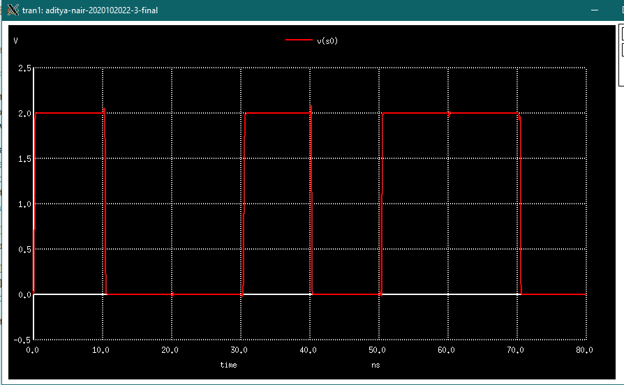

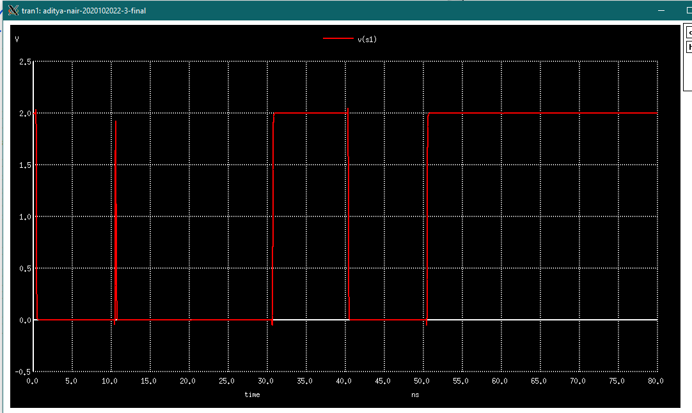

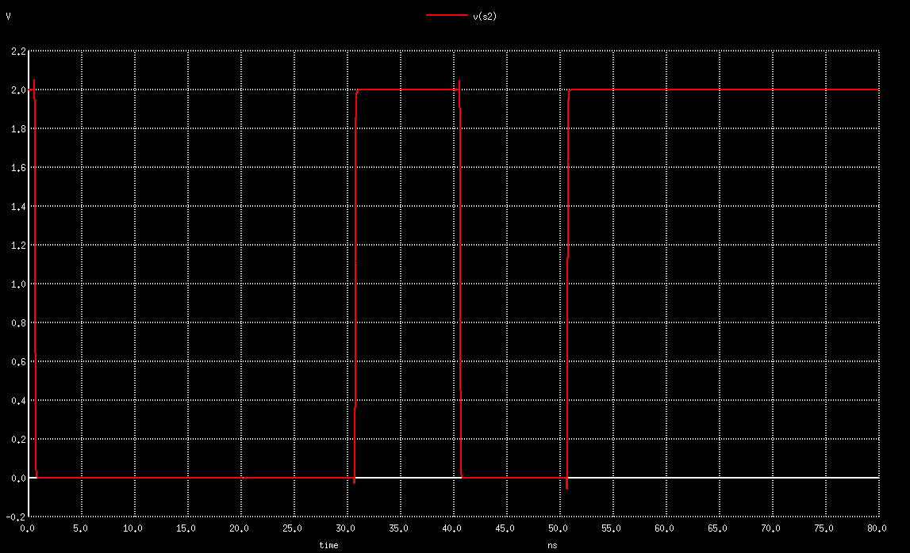

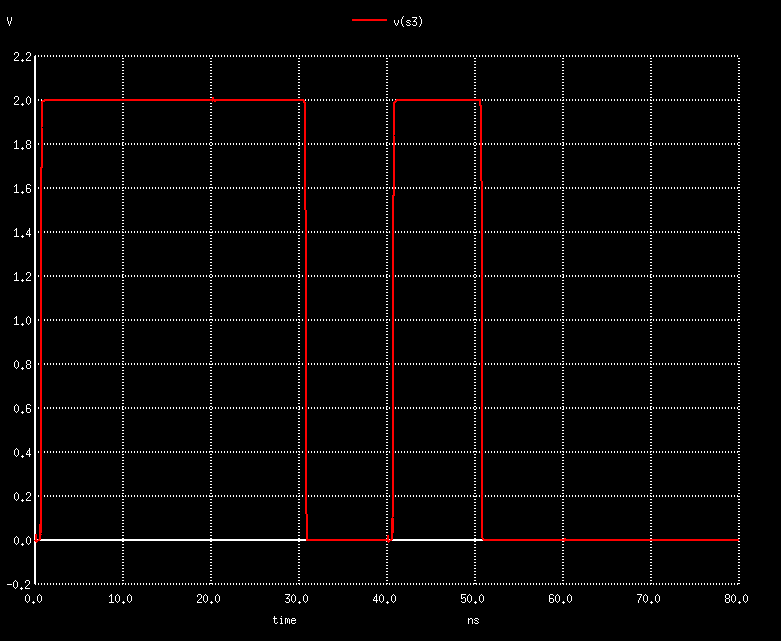

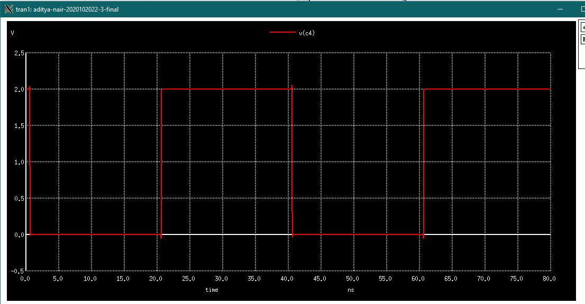

## Stick diagrams of unique gates

### XOR gate

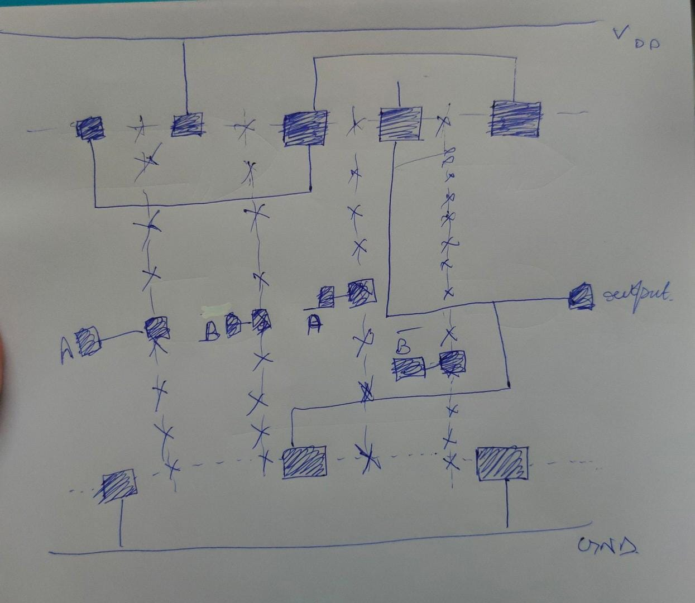

### NAND gate (2,3,4 and 5 inputs)
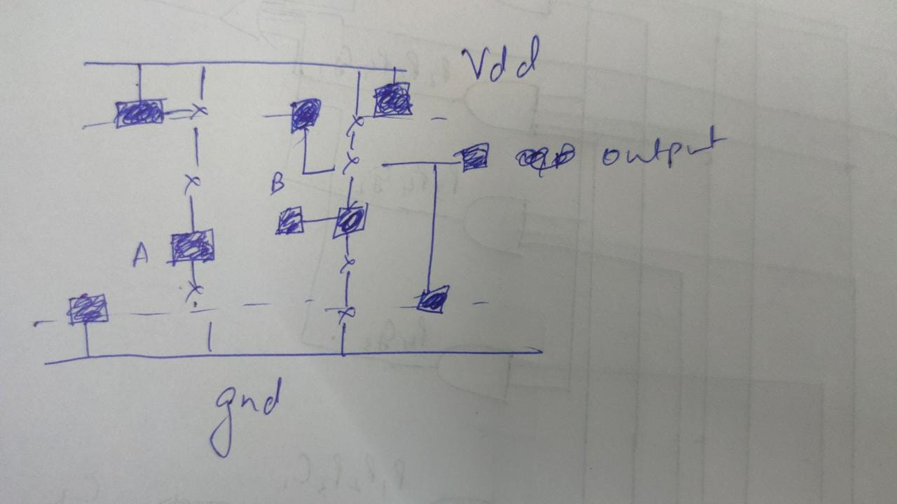

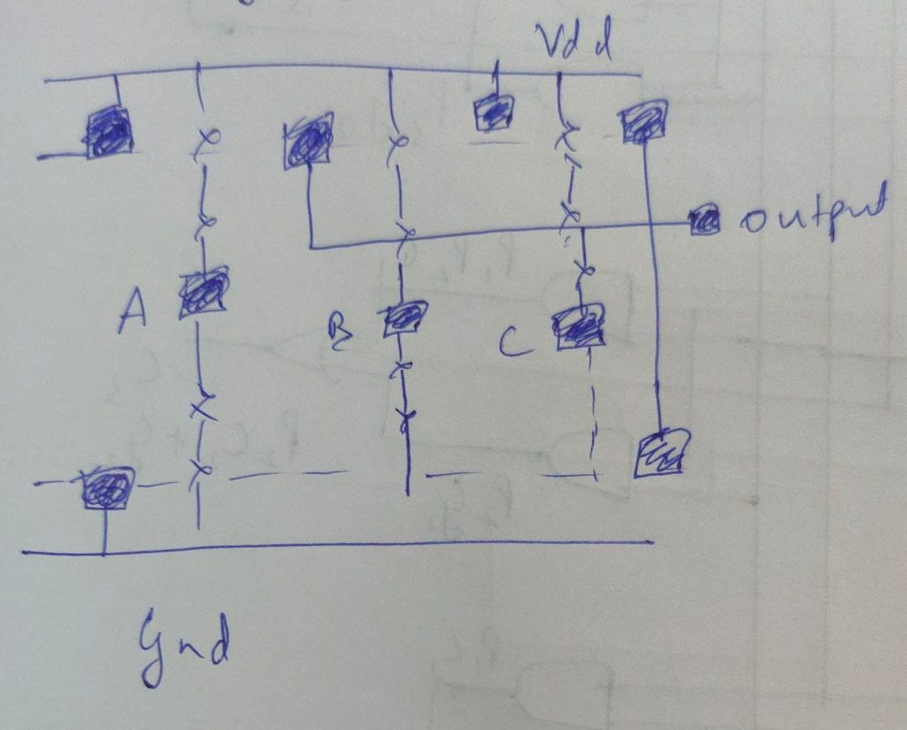

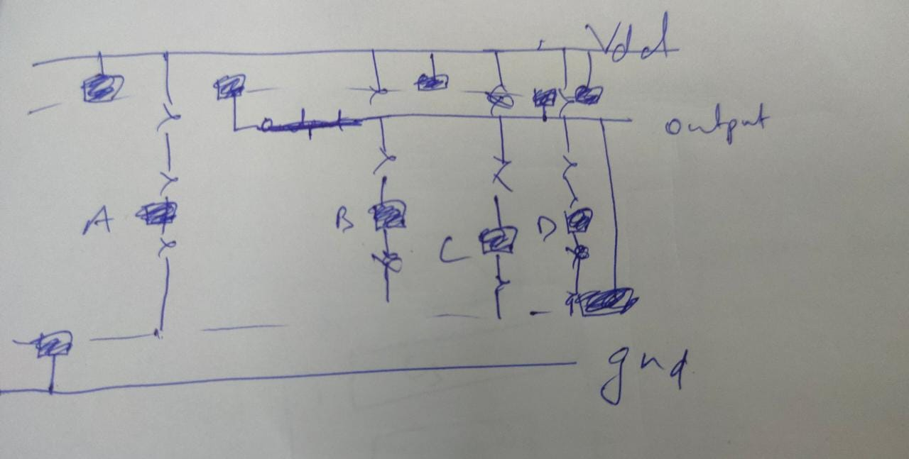

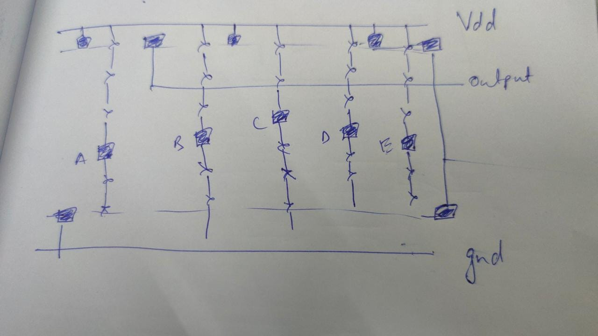

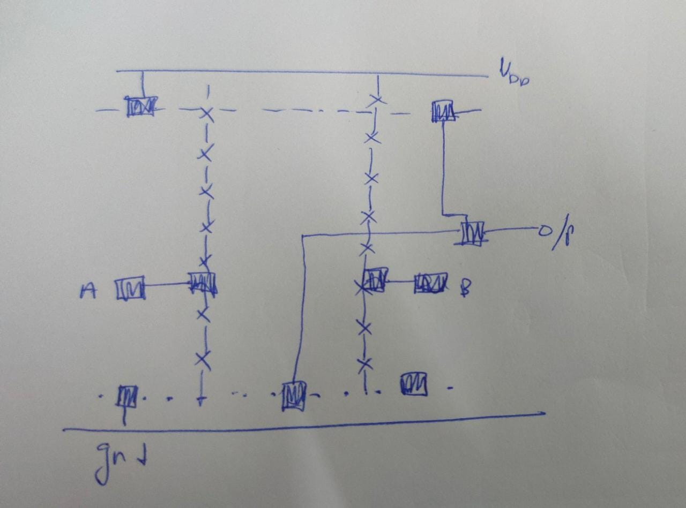

## MAGIC
- Note: here we have assumed C0 = 0.
- There are no attached images of layouts, since the layouts are big and the labels won't be visible in the image. The circuit shall be shown in detail during the evaluations.
### P and G block
```SPICE
* SPICE3 file created from PandG.ext - technology: scmos

.include TSMC_180nm.txt

vdd vdd gnd 2.0V

.option scale=0.09u

Vin1 a0 gnd pulse(0 2.0 0 0.01p 0.01p 10n 20n)
Vin2 b0 gnd pulse(0 2.0 0 0.01p 0.01p 20n 40n)

Vin3 a1 gnd pulse(0 2.0 0 0.01p 0.01p 10n 20n)
Vin4 b1 gnd pulse(0 2.0 0 0.01p 0.01p 20n 40n)

Vin5 a2 gnd pulse(0 2.0 0 0.01p 0.01p 10n 20n)
Vin6 b2 gnd pulse(0 2.0 0 0.01p 0.01p 20n 40n)

Vin7 a3 gnd pulse(0 2.0 0 0.01p 0.01p 10n 20n)
Vin8 b3 gnd pulse(0 2.0 0 0.01p 0.01p 20n 40n)


M1000 b3bar b3 vdd XORinv_0/NOT_0/w_0_0# CMOSP w=8 l=2
+  ad=40 pd=26 as=188 ps=112
M1001 b3bar b3 gnd gnd CMOSN w=4 l=2
+  ad=20 pd=18 as=170 ps=82
M1002 a3bar a3 vdd XORinv_0/NOT_1/w_0_0# CMOSP w=8 l=2
+  ad=40 pd=26 as=0 ps=0
M1003 a3bar a3 gnd gnd CMOSN w=4 l=2
+  ad=20 pd=18 as=0 ps=0
M1004 vdd b3 XORinv_0/XOR_0/a_n5_3# XORinv_0/XOR_0/w_n57_n3# CMOSP w=9 l=4
+  ad=0 pd=0 as=162 ps=54
M1005 gnd a3 XORinv_0/XOR_0/a_n41_n54# gnd CMOSN w=13 l=4
+  ad=0 pd=0 as=468 ps=124
M1006 p3 b3 XORinv_0/XOR_0/a_n41_n54# gnd CMOSN w=13 l=4
+  ad=624 pd=148 as=0 ps=0
M1007 XORinv_0/XOR_0/a_n41_n54# b3bar p3 gnd CMOSN w=13 l=4
+  ad=0 pd=0 as=0 ps=0
M1008 XORinv_0/XOR_0/a_n41_n54# a3bar gnd gnd CMOSN w=13 l=4
+  ad=0 pd=0 as=0 ps=0
M1009 XORinv_0/XOR_0/a_n5_3# a3bar p3 XORinv_0/XOR_0/w_n57_n3# CMOSP w=9 l=4
+  ad=0 pd=0 as=90 ps=38
M1010 XORinv_0/XOR_0/a_n41_3# b3bar vdd XORinv_0/XOR_0/w_n57_n3# CMOSP w=9 l=4
+  ad=162 pd=54 as=0 ps=0
M1011 p3 a3 XORinv_0/XOR_0/a_n41_3# XORinv_0/XOR_0/w_n57_n3# CMOSP w=9 l=4
+  ad=0 pd=0 as=0 ps=0
M1012 g3 AND2_0/a_n1_n4# vdd AND2_0/NOTNOT_0/w_0_0# CMOSP w=8 l=2
+  ad=40 pd=26 as=265 ps=112
M1013 g3 AND2_0/a_n1_n4# gnd gnd CMOSN w=4 l=2
+  ad=20 pd=18 as=110 ps=56
M1014 AND2_0/a_n1_n4# a3 vdd AND2_0/w_n25_n10# CMOSP w=9 l=5
+  ad=117 pd=44 as=0 ps=0
M1015 AND2_0/a_n1_n48# a3 gnd gnd CMOSN w=9 l=5
+  ad=117 pd=44 as=0 ps=0
M1016 vdd b3 AND2_0/a_n1_n4# AND2_0/w_n25_n10# CMOSP w=9 l=5
+  ad=0 pd=0 as=0 ps=0
M1017 AND2_0/a_n1_n4# b3 AND2_0/a_n1_n48# gnd CMOSN w=9 l=5
+  ad=135 pd=48 as=0 ps=0
M1018 a_11_n162# b2bar vdd w_n5_n168# CMOSP w=9 l=4
+  ad=162 pd=54 as=1359 ps=672
M1019 a_47_n445# a1bar p1 w_n5_n451# CMOSP w=9 l=4
+  ad=162 pd=54 as=90 ps=38
M1020 g1in b1 a_12_n610# gnd CMOSN w=9 l=5
+  ad=135 pd=48 as=117 ps=44
M1021 gnd a0 a_11_n774# gnd CMOSN w=13 l=4
+  ad=840 pd=414 as=468 ps=124
M1022 p2 a2 a_11_n162# w_n5_n168# CMOSP w=9 l=4
+  ad=90 pd=38 as=0 ps=0
M1023 a1bar a1 gnd gnd CMOSN w=4 l=2
+  ad=20 pd=18 as=0 ps=0
M1024 vdd b1 a_47_n445# w_n5_n451# CMOSP w=9 l=4
+  ad=0 pd=0 as=0 ps=0
M1025 g1 g1in gnd gnd CMOSN w=4 l=2
+  ad=20 pd=18 as=0 ps=0
M1026 a0bar a0 vdd w_30_n660# CMOSP w=8 l=2
+  ad=40 pd=26 as=0 ps=0
M1027 a_11_n774# a0bar gnd gnd CMOSN w=13 l=4
+  ad=0 pd=0 as=0 ps=0
M1028 g0 g0in vdd w_59_n874# CMOSP w=8 l=2
+  ad=40 pd=26 as=0 ps=0
M1029 a_47_n162# a2bar p2 w_n5_n168# CMOSP w=9 l=4
+  ad=162 pd=54 as=0 ps=0
M1030 g2in b2 a_12_n327# gnd CMOSN w=9 l=5
+  ad=135 pd=48 as=117 ps=44
M1031 a2bar a2 gnd gnd CMOSN w=4 l=2
+  ad=20 pd=18 as=0 ps=0
M1032 g1in a1 vdd w_n12_n572# CMOSP w=9 l=5
+  ad=117 pd=44 as=0 ps=0
M1033 p0 b0 a_11_n774# gnd CMOSN w=13 l=4
+  ad=624 pd=148 as=0 ps=0
M1034 vdd b2 a_47_n162# w_n5_n168# CMOSP w=9 l=4
+  ad=0 pd=0 as=0 ps=0
M1035 g2 g2in gnd gnd CMOSN w=4 l=2
+  ad=20 pd=18 as=0 ps=0
M1036 b1bar b1 gnd gnd CMOSN w=4 l=2
+  ad=20 pd=18 as=0 ps=0
M1037 b0bar b0 vdd w_n47_n743# CMOSP w=8 l=2
+  ad=40 pd=26 as=0 ps=0
M1038 vdd b0 g0in w_n12_n844# CMOSP w=9 l=5
+  ad=0 pd=0 as=117 ps=44
M1039 g2in a2 vdd w_n12_n289# CMOSP w=9 l=5
+  ad=117 pd=44 as=0 ps=0
M1040 b2bar b2 gnd gnd CMOSN w=4 l=2
+  ad=20 pd=18 as=0 ps=0
M1041 a_11_n717# b0bar vdd w_n5_n723# CMOSP w=9 l=4
+  ad=162 pd=54 as=0 ps=0
M1042 a_11_n502# b1bar p1 gnd CMOSN w=13 l=4
+  ad=468 pd=124 as=624 ps=148
M1043 a_12_n610# a1 gnd gnd CMOSN w=9 l=5
+  ad=0 pd=0 as=0 ps=0
M1044 p0 a0 a_11_n717# w_n5_n723# CMOSP w=9 l=4
+  ad=90 pd=38 as=0 ps=0
M1045 gnd a1 a_11_n502# gnd CMOSN w=13 l=4
+  ad=0 pd=0 as=0 ps=0
M1046 a1bar a1 vdd w_30_n388# CMOSP w=8 l=2
+  ad=40 pd=26 as=0 ps=0
M1047 g0in b0 a_12_n882# gnd CMOSN w=9 l=5
+  ad=135 pd=48 as=117 ps=44
M1048 a_11_n219# b2bar p2 gnd CMOSN w=13 l=4
+  ad=468 pd=124 as=624 ps=148
M1049 a_12_n327# a2 gnd gnd CMOSN w=9 l=5
+  ad=0 pd=0 as=0 ps=0
M1050 g1 g1in vdd w_59_n602# CMOSP w=8 l=2
+  ad=40 pd=26 as=0 ps=0
M1051 a0bar a0 gnd gnd CMOSN w=4 l=2
+  ad=20 pd=18 as=0 ps=0
M1052 a_47_n717# a0bar p0 w_n5_n723# CMOSP w=9 l=4
+  ad=162 pd=54 as=0 ps=0
M1053 a_11_n502# a1bar gnd gnd CMOSN w=13 l=4
+  ad=0 pd=0 as=0 ps=0
M1054 vdd b0 a_47_n717# w_n5_n723# CMOSP w=9 l=4
+  ad=0 pd=0 as=0 ps=0
M1055 a2bar a2 vdd w_30_n105# CMOSP w=8 l=2
+  ad=40 pd=26 as=0 ps=0
M1056 gnd a2 a_11_n219# gnd CMOSN w=13 l=4
+  ad=0 pd=0 as=0 ps=0
M1057 p1 b1 a_11_n502# gnd CMOSN w=13 l=4
+  ad=0 pd=0 as=0 ps=0
M1058 g0 g0in gnd gnd CMOSN w=4 l=2
+  ad=20 pd=18 as=0 ps=0
M1059 g2 g2in vdd w_59_n319# CMOSP w=8 l=2
+  ad=40 pd=26 as=0 ps=0
M1060 b1bar b1 vdd w_n47_n471# CMOSP w=8 l=2
+  ad=40 pd=26 as=0 ps=0
M1061 g0in a0 vdd w_n12_n844# CMOSP w=9 l=5
+  ad=0 pd=0 as=0 ps=0
M1062 a_11_n219# a2bar gnd gnd CMOSN w=13 l=4
+  ad=0 pd=0 as=0 ps=0
M1063 p2 b2 a_11_n219# gnd CMOSN w=13 l=4
+  ad=0 pd=0 as=0 ps=0
M1064 vdd b1 g1in w_n12_n572# CMOSP w=9 l=5
+  ad=0 pd=0 as=0 ps=0
M1065 b0bar b0 gnd gnd CMOSN w=4 l=2
+  ad=20 pd=18 as=0 ps=0
M1066 a_11_n445# b1bar vdd w_n5_n451# CMOSP w=9 l=4
+  ad=162 pd=54 as=0 ps=0
M1067 b2bar b2 vdd w_n47_n188# CMOSP w=8 l=2
+  ad=40 pd=26 as=0 ps=0
M1068 p1 a1 a_11_n445# w_n5_n451# CMOSP w=9 l=4
+  ad=0 pd=0 as=0 ps=0
M1069 vdd b2 g2in w_n12_n289# CMOSP w=9 l=5
+  ad=0 pd=0 as=0 ps=0
M1070 a_12_n882# a0 gnd gnd CMOSN w=9 l=5
+  ad=0 pd=0 as=0 ps=0
M1071 a_11_n774# b0bar p0 gnd CMOSN w=13 l=4
+  ad=0 pd=0 as=0 ps=0
C0 gnd gnd 4.50fF
C1 vdd gnd 2.61fF
C2 gnd gnd 2.73fF

.control
tran 1n 80n
set curplottitle= Aditya-Nair-2020102022-5-PandG
plot v(a0) 
plot v(b0)

plot v(p0)
plot v(g0)

plot v(p1)
plot v(g1)

plot v(p2)
plot v(g2)

plot v(p3)
plot v(g3)
.endc
.end

* AND2_0/NOTNOT_0/a_13_n12# -> g3
```
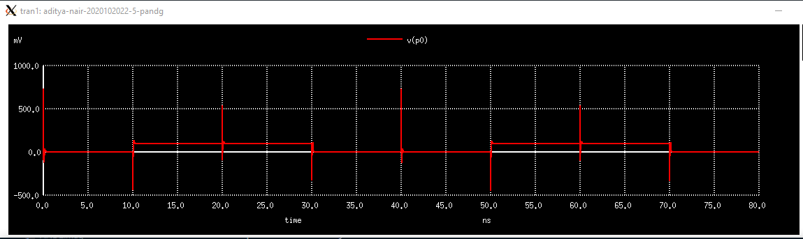

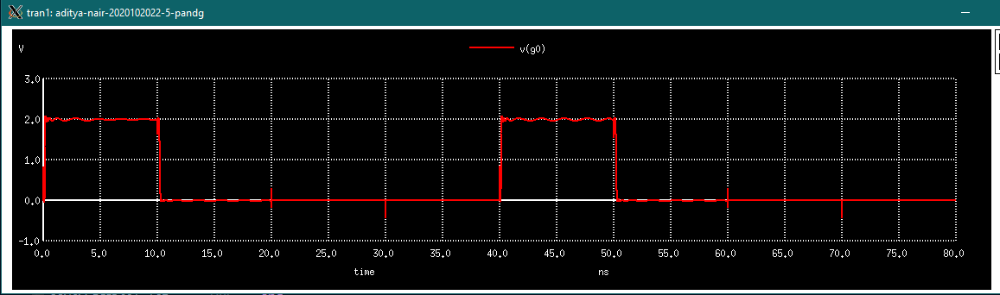

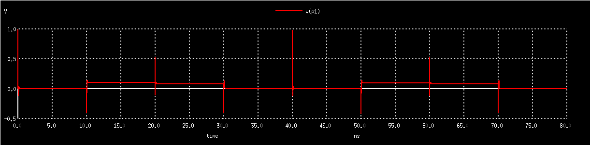

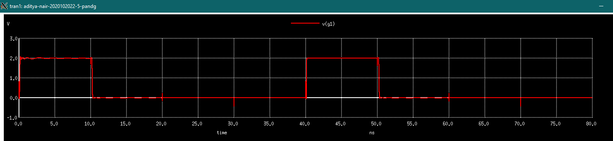

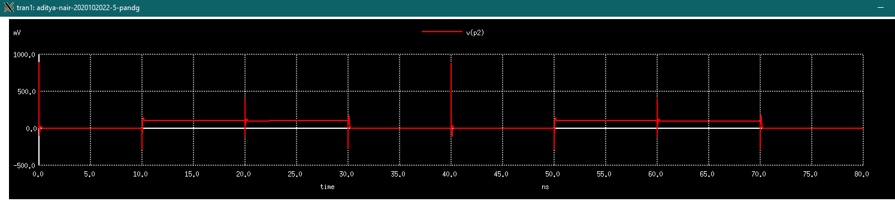


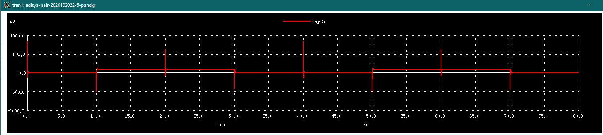

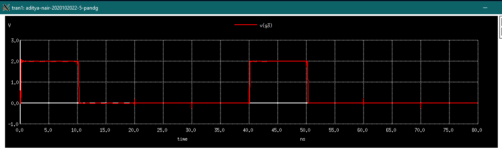

### Carry-lookahead block
```SPICE
* SPICE3 file created from CLA.ext - technology: scmos

.include TSMC_180nm.txt

vdd vdd gnd 2.0V

.option scale=0.09u

Vin1 p0 gnd pulse(0 2.0 0 0.01p 0.01p 10n 20n)
Vin2 g0 gnd pulse(2.0 0 0 0.01p 0.01p 20n 40n)

Vin3 p1 gnd pulse(2.0 0 0 0.01p 0.01p 10n 20n)
Vin4 g1 gnd pulse(0 2.0 0 0.01p 0.01p 20n 40n)

Vin5 p2 gnd pulse(2.0 0 0 0.01p 0.01p 10n 20n)
Vin6 g2 gnd pulse(0 2.0 0 0.01p 0.01p 20n 40n)

Vin7 p3 gnd pulse(0 2.0 0 0.01p 0.01p 10n 20n)
Vin8 g3 gnd pulse(2.0 0 0 0.01p 0.01p 20n 40n)

M1000 p3p2p1g0 AND4_0/out1 vdd AND4_0/NOT_0/w_0_0# CMOSP w=8 l=2
+  ad=40 pd=26 as=142 ps=96
M1001 p3p2p1g0 AND4_0/out1 gnd gnd CMOSN w=4 l=2
+  ad=20 pd=18 as=50 ps=40
M1002 AND4_0/a_7_n52# p3 gnd gnd CMOSN w=6 l=2
+  ad=48 pd=28 as=0 ps=0
M1003 AND4_0/a_25_n52# p1 AND4_0/a_17_n52# gnd CMOSN w=6 l=2
+  ad=42 pd=26 as=36 ps=24
M1004 vdd p2 AND4_0/out1 AND4_0/w_n6_n6# CMOSP w=6 l=2
+  ad=0 pd=0 as=90 ps=54
M1005 vdd g0 AND4_0/out1 AND4_0/w_n6_n6# CMOSP w=6 l=2
+  ad=0 pd=0 as=0 ps=0
M1006 AND4_0/out1 p1 vdd AND4_0/w_n6_n6# CMOSP w=6 l=2
+  ad=0 pd=0 as=0 ps=0
M1007 AND4_0/out1 g0 AND4_0/a_25_n52# gnd CMOSN w=6 l=2
+  ad=42 pd=26 as=0 ps=0
M1008 AND4_0/out1 p3 vdd AND4_0/w_n6_n6# CMOSP w=6 l=2
+  ad=0 pd=0 as=0 ps=0
M1009 AND4_0/a_17_n52# p2 AND4_0/a_7_n52# gnd CMOSN w=6 l=2
+  ad=0 pd=0 as=0 ps=0
M1010 p2p1g0 AND3_0/out1 vdd AND3_0/NOT_0/w_0_0# CMOSP w=8 l=2
+  ad=40 pd=26 as=112 ps=74
M1011 p2p1g0 AND3_0/out1 gnd gnd CMOSN w=4 l=2
+  ad=20 pd=18 as=798 ps=194
M1012 AND3_0/out1 p2 vdd AND3_0/w_n32_7# CMOSP w=6 l=2
+  ad=78 pd=50 as=0 ps=0
M1013 vdd p1 AND3_0/out1 AND3_0/w_n32_7# CMOSP w=6 l=2
+  ad=0 pd=0 as=0 ps=0
M1014 AND3_0/a_n10_n22# p1 AND3_0/a_n18_n22# gnd CMOSN w=3 l=2
+  ad=18 pd=18 as=18 ps=18
M1015 AND3_0/out1 p2 AND3_0/a_n10_n22# gnd CMOSN w=3 l=2
+  ad=25 pd=22 as=0 ps=0
M1016 AND3_0/a_n18_n22# g0 gnd gnd CMOSN w=3 l=2
+  ad=0 pd=0 as=0 ps=0
M1017 AND3_0/out1 g0 vdd AND3_0/w_n32_7# CMOSP w=6 l=2
+  ad=0 pd=0 as=0 ps=0
M1018 p3p2g1 AND3_1/out1 vdd AND3_1/NOT_0/w_0_0# CMOSP w=8 l=2
+  ad=40 pd=26 as=112 ps=74
M1019 p3p2g1 AND3_1/out1 gnd gnd CMOSN w=4 l=2
+  ad=20 pd=18 as=42 ps=38
M1020 AND3_1/out1 p3 vdd AND3_1/w_n32_7# CMOSP w=6 l=2
+  ad=78 pd=50 as=0 ps=0
M1021 vdd p2 AND3_1/out1 AND3_1/w_n32_7# CMOSP w=6 l=2
+  ad=0 pd=0 as=0 ps=0
M1022 AND3_1/a_n10_n22# p2 AND3_1/a_n18_n22# gnd CMOSN w=3 l=2
+  ad=18 pd=18 as=18 ps=18
M1023 AND3_1/out1 p3 AND3_1/a_n10_n22# gnd CMOSN w=3 l=2
+  ad=25 pd=22 as=0 ps=0
M1024 AND3_1/a_n18_n22# g1 gnd gnd CMOSN w=3 l=2
+  ad=0 pd=0 as=0 ps=0
M1025 AND3_1/out1 g1 vdd AND3_1/w_n32_7# CMOSP w=6 l=2
+  ad=0 pd=0 as=0 ps=0
M1026 p2g1 AND2_1/a_n1_n4# vdd AND2_1/NOTNOT_0/w_0_0# CMOSP w=8 l=2
+  ad=40 pd=26 as=265 ps=112
M1027 p2g1 AND2_1/a_n1_n4# gnd gnd CMOSN w=4 l=2
+  ad=20 pd=18 as=110 ps=56
M1028 AND2_1/a_n1_n4# p2 vdd AND2_1/w_n25_n10# CMOSP w=9 l=5
+  ad=117 pd=44 as=0 ps=0
M1029 AND2_1/a_n1_n48# p2 gnd gnd CMOSN w=9 l=5
+  ad=117 pd=44 as=0 ps=0
M1030 vdd g1 AND2_1/a_n1_n4# AND2_1/w_n25_n10# CMOSP w=9 l=5
+  ad=0 pd=0 as=0 ps=0
M1031 AND2_1/a_n1_n4# g1 AND2_1/a_n1_n48# gnd CMOSN w=9 l=5
+  ad=135 pd=48 as=0 ps=0
M1032 g0p1 AND2_0/a_n1_n4# vdd AND2_0/NOTNOT_0/w_0_0# CMOSP w=8 l=2
+  ad=40 pd=26 as=265 ps=112
M1033 g0p1 AND2_0/a_n1_n4# gnd gnd CMOSN w=4 l=2
+  ad=20 pd=18 as=991 ps=240
M1034 AND2_0/a_n1_n4# g0 vdd AND2_0/w_n25_n10# CMOSP w=9 l=5
+  ad=117 pd=44 as=0 ps=0
M1035 AND2_0/a_n1_n48# g0 gnd gnd CMOSN w=9 l=5
+  ad=117 pd=44 as=0 ps=0
M1036 vdd p1 AND2_0/a_n1_n4# AND2_0/w_n25_n10# CMOSP w=9 l=5
+  ad=0 pd=0 as=0 ps=0
M1037 AND2_0/a_n1_n4# p1 AND2_0/a_n1_n48# gnd CMOSN w=9 l=5
+  ad=135 pd=48 as=0 ps=0
M1038 p3g2 AND2_2/a_n1_n4# vdd AND2_2/NOTNOT_0/w_0_0# CMOSP w=8 l=2
+  ad=40 pd=26 as=265 ps=112
M1039 p3g2 AND2_2/a_n1_n4# gnd gnd CMOSN w=4 l=2
+  ad=20 pd=18 as=110 ps=56
M1040 AND2_2/a_n1_n4# p3 vdd AND2_2/w_n25_n10# CMOSP w=9 l=5
+  ad=117 pd=44 as=0 ps=0
M1041 AND2_2/a_n1_n48# p3 gnd gnd CMOSN w=9 l=5
+  ad=117 pd=44 as=0 ps=0
M1042 vdd g2 AND2_2/a_n1_n4# AND2_2/w_n25_n10# CMOSP w=9 l=5
+  ad=0 pd=0 as=0 ps=0
M1043 AND2_2/a_n1_n4# g2 AND2_2/a_n1_n48# gnd CMOSN w=9 l=5
+  ad=135 pd=48 as=0 ps=0
M1044 OR_0/NOTNOT_0/a_13_n12# OR_0/a_0_n113# vdd OR_0/NOTNOT_0/w_0_0# CMOSP w=8 l=2
+  ad=40 pd=26 as=326 ps=100
M1045 OR_0/NOTNOT_0/a_13_n12# OR_0/a_0_n113# gnd gnd CMOSN w=4 l=2
+  ad=20 pd=18 as=0 ps=0
M1046 OR_0/a_0_n113# g1 OR_0/a_0_n35# OR_0/w_n25_n47# CMOSP w=26 l=7
+  ad=390 pd=82 as=1378 ps=158
M1047 gnd g1 OR_0/a_0_n113# gnd CMOSN w=21 l=7
+  ad=0 pd=0 as=1113 ps=148
M1048 OR_0/a_0_n35# g0p1 vdd OR_0/w_n25_n47# CMOSP w=26 l=7
+  ad=0 pd=0 as=0 ps=0
M1049 OR_0/a_0_n113# g0p1 gnd gnd CMOSN w=21 l=7
+  ad=0 pd=0 as=0 ps=0
M1050 p3p2p1g0orp3p2g1 OR_1/a_0_n113# vdd OR_1/NOTNOT_0/w_0_0# CMOSP w=8 l=2
+  ad=40 pd=26 as=326 ps=100
M1051 p3p2p1g0orp3p2g1 OR_1/a_0_n113# gnd gnd CMOSN w=4 l=2
+  ad=20 pd=18 as=881 ps=184
M1052 OR_1/a_0_n113# p3p2g1 OR_1/a_0_n35# OR_1/w_n25_n47# CMOSP w=26 l=7
+  ad=390 pd=82 as=1378 ps=158
M1053 gnd p3p2g1 OR_1/a_0_n113# gnd CMOSN w=21 l=7
+  ad=0 pd=0 as=1113 ps=148
M1054 OR_1/a_0_n35# p3p2p1g0 vdd OR_1/w_n25_n47# CMOSP w=26 l=7
+  ad=0 pd=0 as=0 ps=0
M1055 OR_1/a_0_n113# p3p2p1g0 gnd gnd CMOSN w=21 l=7
+  ad=0 pd=0 as=0 ps=0
M1056 p3p2p1g0orp3p2g1org2p3 OR_2/a_0_n113# vdd OR_2/NOTNOT_0/w_0_0# CMOSP w=8 l=2
+  ad=40 pd=26 as=326 ps=100
M1057 p3p2p1g0orp3p2g1org2p3 OR_2/a_0_n113# gnd gnd CMOSN w=4 l=2
+  ad=20 pd=18 as=881 ps=184
M1058 OR_2/a_0_n113# p3g2 OR_2/a_0_n35# OR_2/w_n25_n47# CMOSP w=26 l=7
+  ad=390 pd=82 as=1378 ps=158
M1059 gnd p3g2 OR_2/a_0_n113# gnd CMOSN w=21 l=7
+  ad=0 pd=0 as=1113 ps=148
M1060 OR_2/a_0_n35# p3p2p1g0orp3p2g1 vdd OR_2/w_n25_n47# CMOSP w=26 l=7
+  ad=0 pd=0 as=0 ps=0
M1061 OR_2/a_0_n113# p3p2p1g0orp3p2g1 gnd gnd CMOSN w=21 l=7
+  ad=0 pd=0 as=0 ps=0
M1062 OR_3/NOTNOT_0/a_13_n12# OR_3/a_0_n113# vdd OR_3/NOTNOT_0/w_0_0# CMOSP w=8 l=2
+  ad=40 pd=26 as=326 ps=100
M1063 OR_3/NOTNOT_0/a_13_n12# OR_3/a_0_n113# gnd gnd CMOSN w=4 l=2
+  ad=20 pd=18 as=881 ps=184
M1064 OR_3/a_0_n113# g3 OR_3/a_0_n35# OR_3/w_n25_n47# CMOSP w=26 l=7
+  ad=390 pd=82 as=1378 ps=158
M1065 gnd g3 OR_3/a_0_n113# gnd CMOSN w=21 l=7
+  ad=0 pd=0 as=1113 ps=148
M1066 OR_3/a_0_n35# p3p2p1g0orp3p2g1org2p3 vdd OR_3/w_n25_n47# CMOSP w=26 l=7
+  ad=0 pd=0 as=0 ps=0
M1067 OR_3/a_0_n113# p3p2p1g0orp3p2g1org2p3 gnd gnd CMOSN w=21 l=7
+  ad=0 pd=0 as=0 ps=0
M1068 a_106_n92# p2g1 vdd w_81_n104# CMOSP w=26 l=7
+  ad=1378 pd=158 as=652 ps=200
M1069 a_106_n170# p2p1g0 a_106_n92# w_81_n104# CMOSP w=26 l=7
+  ad=390 pd=82 as=0 ps=0
M1070 p2g1orp2p1g0 a_106_n170# vdd w_226_n174# CMOSP w=8 l=2
+  ad=40 pd=26 as=0 ps=0
M1071 gnd g2 a_310_n170# gnd CMOSN w=21 l=7
+  ad=0 pd=0 as=1113 ps=148
M1072 c3 a_310_n170# gnd gnd CMOSN w=4 l=2
+  ad=20 pd=18 as=0 ps=0
M1073 a_310_n92# p2g1orp2p1g0 vdd w_285_n104# CMOSP w=26 l=7
+  ad=1378 pd=158 as=0 ps=0
M1074 a_310_n170# p2g1orp2p1g0 gnd gnd CMOSN w=21 l=7
+  ad=0 pd=0 as=0 ps=0
M1075 a_310_n170# g2 a_310_n92# w_285_n104# CMOSP w=26 l=7
+  ad=390 pd=82 as=0 ps=0
M1076 gnd p2p1g0 a_106_n170# gnd CMOSN w=21 l=7
+  ad=0 pd=0 as=1113 ps=148
M1077 p2g1orp2p1g0 a_106_n170# gnd gnd CMOSN w=4 l=2
+  ad=20 pd=18 as=0 ps=0
M1078 a_106_n170# p2g1 gnd gnd CMOSN w=21 l=7
+  ad=0 pd=0 as=0 ps=0
M1079 c3 a_310_n170# vdd w_430_n174# CMOSP w=8 l=2
+  ad=40 pd=26 as=0 ps=0

C0 w_285_n104# gnd 5.21fF
C1 OR_3/w_n25_n47# gnd 5.21fF
C2 OR_2/w_n25_n47# gnd 5.21fF
C3 OR_1/w_n25_n47# gnd 5.21fF
C4 OR_0/w_n25_n47# gnd 5.21fF
C5 gnd gnd 2.27fF

.control
tran 1s 120ns
set curplottitle= Aditya-Nair-2020102022-5-CLA
plot v(p0)
plot v(g0)

plot v(p1)
plot v(g1)

plot v(p2)
plot v(g2)

plot v(p3)
plot v(g3)

* plot v(c1)
* plot v(c2)
plot v(c3)
* plot v(c4)
.endc
.end
```
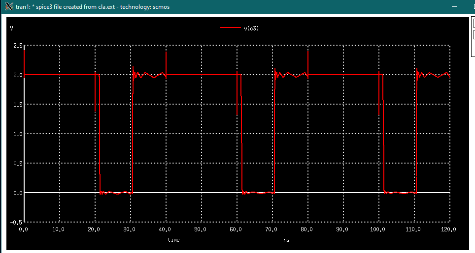

### Final circuit
```SPICE
* SPICE3 file created from FINALE.ext - technology: scmos

.include TSMC_180nm.txt

vdd vdd gnd 2.0V

.option scale=0.09u

Vin1 a0 gnd pulse(0 2.0 0 0.01p 0.01p 10n 20n)
Vin2 b0 gnd pulse(2.0 0 0 0.01p 0.01p 20n 40n)

Vin3 a1 gnd pulse(2.0 0 0 0.01p 0.01p 10n 20n)
Vin4 b1 gnd pulse(0 2.0 0 0.01p 0.01p 20n 40n)

Vin5 a2 gnd pulse(2.0 0 0 0.01p 0.01p 10n 20n)
Vin6 b2 gnd pulse(0 2.0 0 0.01p 0.01p 20n 40n)

Vin7 a3 gnd pulse(0 2.0 0 0.01p 0.01p 10n 20n)
Vin8 b3 gnd pulse(2.0 0 0 0.01p 0.01p 20n 40n)

M1000 CLA_0/m1_59_n322# CLA_0/AND4_0/out1 CLA_0/AND4_0/vdd CLA_0/AND4_0/NOT_0/w_0_0# CMOSP w=8 l=2
+  ad=40 pd=26 as=142 ps=96
M1001 CLA_0/m1_59_n322# CLA_0/AND4_0/out1 CLA_0/AND4_0/gnd Gnd CMOSN w=4 l=2
+  ad=20 pd=18 as=50 ps=40
M1002 CLA_0/AND4_0/a_7_n52# PandG_0/XORinv_0/XOR_0/out CLA_0/AND4_0/gnd Gnd CMOSN w=6 l=2
+  ad=48 pd=28 as=0 ps=0
M1003 CLA_0/AND4_0/a_25_n52# PandG_0/p1 CLA_0/AND4_0/a_17_n52# Gnd CMOSN w=6 l=2
+  ad=42 pd=26 as=36 ps=24
M1004 CLA_0/AND4_0/vdd PandG_0/p2 CLA_0/AND4_0/out1 CLA_0/AND4_0/w_n6_n6# CMOSP w=6 l=2
+  ad=0 pd=0 as=90 ps=54
M1005 CLA_0/AND4_0/vdd m1_210_416# CLA_0/AND4_0/out1 CLA_0/AND4_0/w_n6_n6# CMOSP w=6 l=2
+  ad=0 pd=0 as=0 ps=0
M1006 CLA_0/AND4_0/out1 PandG_0/p1 CLA_0/AND4_0/vdd CLA_0/AND4_0/w_n6_n6# CMOSP w=6 l=2
+  ad=0 pd=0 as=0 ps=0
M1007 CLA_0/AND4_0/out1 m1_210_416# CLA_0/AND4_0/a_25_n52# Gnd CMOSN w=6 l=2
+  ad=42 pd=26 as=0 ps=0
M1008 CLA_0/AND4_0/out1 PandG_0/XORinv_0/XOR_0/out CLA_0/AND4_0/vdd CLA_0/AND4_0/w_n6_n6# CMOSP w=6 l=2
+  ad=0 pd=0 as=0 ps=0
M1009 CLA_0/AND4_0/a_17_n52# PandG_0/p2 CLA_0/AND4_0/a_7_n52# Gnd CMOSN w=6 l=2
+  ad=0 pd=0 as=0 ps=0
M1010 CLA_0/p2p1g0 CLA_0/AND3_0/out1 CLA_0/AND3_0/vdd CLA_0/AND3_0/NOT_0/w_0_0# CMOSP w=8 l=2
+  ad=40 pd=26 as=112 ps=74
M1011 CLA_0/p2p1g0 CLA_0/AND3_0/out1 CLA_0/gnd Gnd CMOSN w=4 l=2
+  ad=20 pd=18 as=798 ps=194
M1012 CLA_0/AND3_0/out1 PandG_0/p2 CLA_0/AND3_0/vdd CLA_0/AND3_0/w_n32_7# CMOSP w=6 l=2
+  ad=78 pd=50 as=0 ps=0
M1013 CLA_0/AND3_0/vdd PandG_0/p1 CLA_0/AND3_0/out1 CLA_0/AND3_0/w_n32_7# CMOSP w=6 l=2
+  ad=0 pd=0 as=0 ps=0
M1014 CLA_0/AND3_0/a_n10_n22# PandG_0/p1 CLA_0/AND3_0/a_n18_n22# Gnd CMOSN w=3 l=2
+  ad=18 pd=18 as=18 ps=18
M1015 CLA_0/AND3_0/out1 PandG_0/p2 CLA_0/AND3_0/a_n10_n22# Gnd CMOSN w=3 l=2
+  ad=25 pd=22 as=0 ps=0
M1016 CLA_0/AND3_0/a_n18_n22# CLA_0/AND3_0/a_n22_n16# CLA_0/gnd Gnd CMOSN w=3 l=2
+  ad=0 pd=0 as=0 ps=0
M1017 CLA_0/AND3_0/out1 CLA_0/AND3_0/a_n22_n16# CLA_0/AND3_0/vdd CLA_0/AND3_0/w_n32_7# CMOSP w=6 l=2
+  ad=0 pd=0 as=0 ps=0
M1018 CLA_0/m1_53_n394# CLA_0/AND3_1/out1 CLA_0/AND3_1/vdd CLA_0/AND3_1/NOT_0/w_0_0# CMOSP w=8 l=2
+  ad=40 pd=26 as=112 ps=74
M1019 CLA_0/m1_53_n394# CLA_0/AND3_1/out1 CLA_0/AND3_1/gnd Gnd CMOSN w=4 l=2
+  ad=20 pd=18 as=42 ps=38
M1020 CLA_0/AND3_1/out1 PandG_0/XORinv_0/XOR_0/out CLA_0/AND3_1/vdd CLA_0/AND3_1/w_n32_7# CMOSP w=6 l=2
+  ad=78 pd=50 as=0 ps=0
M1021 CLA_0/AND3_1/vdd PandG_0/p2 CLA_0/AND3_1/out1 CLA_0/AND3_1/w_n32_7# CMOSP w=6 l=2
+  ad=0 pd=0 as=0 ps=0
M1022 CLA_0/AND3_1/a_n10_n22# PandG_0/p2 CLA_0/AND3_1/a_n18_n22# Gnd CMOSN w=3 l=2
+  ad=18 pd=18 as=18 ps=18
M1023 CLA_0/AND3_1/out1 PandG_0/XORinv_0/XOR_0/out CLA_0/AND3_1/a_n10_n22# Gnd CMOSN w=3 l=2
+  ad=25 pd=22 as=0 ps=0
M1024 CLA_0/AND3_1/a_n18_n22# PandG_0/g1 CLA_0/AND3_1/gnd Gnd CMOSN w=3 l=2
+  ad=0 pd=0 as=0 ps=0
M1025 CLA_0/AND3_1/out1 PandG_0/g1 CLA_0/AND3_1/vdd CLA_0/AND3_1/w_n32_7# CMOSP w=6 l=2
+  ad=0 pd=0 as=0 ps=0
M1026 CLA_0/p2g1 CLA_0/AND2_1/a_n1_n4# CLA_0/AND2_1/vdd CLA_0/AND2_1/NOTNOT_0/w_0_0# CMOSP w=8 l=2
+  ad=40 pd=26 as=265 ps=112
M1027 CLA_0/p2g1 CLA_0/AND2_1/a_n1_n4# CLA_0/AND2_1/NOTNOT_0/gnd Gnd CMOSN w=4 l=2
+  ad=20 pd=18 as=110 ps=56
M1028 CLA_0/AND2_1/a_n1_n4# PandG_0/p2 CLA_0/AND2_1/vdd CLA_0/AND2_1/w_n25_n10# CMOSP w=9 l=5
+  ad=117 pd=44 as=0 ps=0
M1029 CLA_0/AND2_1/a_n1_n48# PandG_0/p2 CLA_0/AND2_1/NOTNOT_0/gnd Gnd CMOSN w=9 l=5
+  ad=117 pd=44 as=0 ps=0
M1030 CLA_0/AND2_1/vdd PandG_0/g1 CLA_0/AND2_1/a_n1_n4# CLA_0/AND2_1/w_n25_n10# CMOSP w=9 l=5
+  ad=0 pd=0 as=0 ps=0
M1031 CLA_0/AND2_1/a_n1_n4# PandG_0/g1 CLA_0/AND2_1/a_n1_n48# Gnd CMOSN w=9 l=5
+  ad=135 pd=48 as=0 ps=0
M1032 CLA_0/m1_67_11# CLA_0/AND2_0/a_n1_n4# CLA_0/AND2_0/vdd CLA_0/AND2_0/NOTNOT_0/w_0_0# CMOSP w=8 l=2
+  ad=40 pd=26 as=265 ps=112
M1033 CLA_0/m1_67_11# CLA_0/AND2_0/a_n1_n4# CLA_0/OR_0/NOTNOT_0/gnd Gnd CMOSN w=4 l=2
+  ad=20 pd=18 as=991 ps=240
M1034 CLA_0/AND2_0/a_n1_n4# CLA_0/AND2_0/a_n6_n51# CLA_0/AND2_0/vdd CLA_0/AND2_0/w_n25_n10# CMOSP w=9 l=5
+  ad=117 pd=44 as=0 ps=0
M1035 CLA_0/AND2_0/a_n1_n48# CLA_0/AND2_0/a_n6_n51# CLA_0/OR_0/NOTNOT_0/gnd Gnd CMOSN w=9 l=5
+  ad=117 pd=44 as=0 ps=0
M1036 CLA_0/AND2_0/vdd PandG_0/p1 CLA_0/AND2_0/a_n1_n4# CLA_0/AND2_0/w_n25_n10# CMOSP w=9 l=5
+  ad=0 pd=0 as=0 ps=0
M1037 CLA_0/AND2_0/a_n1_n4# PandG_0/p1 CLA_0/AND2_0/a_n1_n48# Gnd CMOSN w=9 l=5
+  ad=135 pd=48 as=0 ps=0
M1038 CLA_0/m1_71_n481# CLA_0/AND2_2/a_n1_n4# CLA_0/AND2_2/vdd CLA_0/AND2_2/NOTNOT_0/w_0_0# CMOSP w=8 l=2
+  ad=40 pd=26 as=265 ps=112
M1039 CLA_0/m1_71_n481# CLA_0/AND2_2/a_n1_n4# CLA_0/AND2_2/NOTNOT_0/gnd Gnd CMOSN w=4 l=2
+  ad=20 pd=18 as=110 ps=56
M1040 CLA_0/AND2_2/a_n1_n4# PandG_0/XORinv_0/XOR_0/out CLA_0/AND2_2/vdd CLA_0/AND2_2/w_n25_n10# CMOSP w=9 l=5
+  ad=117 pd=44 as=0 ps=0
M1041 CLA_0/AND2_2/a_n1_n48# PandG_0/XORinv_0/XOR_0/out CLA_0/AND2_2/NOTNOT_0/gnd Gnd CMOSN w=9 l=5
+  ad=117 pd=44 as=0 ps=0
M1042 CLA_0/AND2_2/vdd CLA_0/g2 CLA_0/AND2_2/a_n1_n4# CLA_0/AND2_2/w_n25_n10# CMOSP w=9 l=5
+  ad=0 pd=0 as=0 ps=0
M1043 CLA_0/AND2_2/a_n1_n4# CLA_0/g2 CLA_0/AND2_2/a_n1_n48# Gnd CMOSN w=9 l=5
+  ad=135 pd=48 as=0 ps=0
M1044 m1_142_849# CLA_0/OR_0/a_0_n113# CLA_0/OR_0/NOTNOT_0/vdd CLA_0/OR_0/NOTNOT_0/w_0_0# CMOSP w=8 l=2
+  ad=80 pd=52 as=326 ps=100
M1045 m1_142_849# CLA_0/OR_0/a_0_n113# CLA_0/OR_0/NOTNOT_0/gnd Gnd CMOSN w=4 l=2
+  ad=40 pd=36 as=0 ps=0
M1046 CLA_0/OR_0/a_0_n113# PandG_0/g1 CLA_0/OR_0/a_0_n35# CLA_0/OR_0/w_n25_n47# CMOSP w=26 l=7
+  ad=390 pd=82 as=1378 ps=158
M1047 CLA_0/OR_0/NOTNOT_0/gnd PandG_0/g1 CLA_0/OR_0/a_0_n113# Gnd CMOSN w=21 l=7
+  ad=0 pd=0 as=1113 ps=148
M1048 CLA_0/OR_0/a_0_n35# CLA_0/m1_67_11# CLA_0/OR_0/NOTNOT_0/vdd CLA_0/OR_0/w_n25_n47# CMOSP w=26 l=7
+  ad=0 pd=0 as=0 ps=0
M1049 CLA_0/OR_0/a_0_n113# CLA_0/m1_67_11# CLA_0/OR_0/NOTNOT_0/gnd Gnd CMOSN w=21 l=7
+  ad=0 pd=0 as=0 ps=0
M1050 CLA_0/m1_252_n375# CLA_0/OR_1/a_0_n113# CLA_0/OR_1/NOTNOT_0/vdd CLA_0/OR_1/NOTNOT_0/w_0_0# CMOSP w=8 l=2
+  ad=40 pd=26 as=326 ps=100
M1051 CLA_0/m1_252_n375# CLA_0/OR_1/a_0_n113# CLA_0/OR_1/NOTNOT_0/gnd Gnd CMOSN w=4 l=2
+  ad=20 pd=18 as=881 ps=184
M1052 CLA_0/OR_1/a_0_n113# CLA_0/m1_53_n394# CLA_0/OR_1/a_0_n35# CLA_0/OR_1/w_n25_n47# CMOSP w=26 l=7
+  ad=390 pd=82 as=1378 ps=158
M1053 CLA_0/OR_1/NOTNOT_0/gnd CLA_0/m1_53_n394# CLA_0/OR_1/a_0_n113# Gnd CMOSN w=21 l=7
+  ad=0 pd=0 as=1113 ps=148
M1054 CLA_0/OR_1/a_0_n35# CLA_0/m1_59_n322# CLA_0/OR_1/NOTNOT_0/vdd CLA_0/OR_1/w_n25_n47# CMOSP w=26 l=7
+  ad=0 pd=0 as=0 ps=0
M1055 CLA_0/OR_1/a_0_n113# CLA_0/m1_59_n322# CLA_0/OR_1/NOTNOT_0/gnd Gnd CMOSN w=21 l=7
+  ad=0 pd=0 as=0 ps=0
M1056 CLA_0/m1_478_n459# CLA_0/OR_2/a_0_n113# CLA_0/OR_2/NOTNOT_0/vdd CLA_0/OR_2/NOTNOT_0/w_0_0# CMOSP w=8 l=2
+  ad=40 pd=26 as=326 ps=100
M1057 CLA_0/m1_478_n459# CLA_0/OR_2/a_0_n113# CLA_0/OR_2/NOTNOT_0/gnd Gnd CMOSN w=4 l=2
+  ad=20 pd=18 as=881 ps=184
M1058 CLA_0/OR_2/a_0_n113# CLA_0/m1_71_n481# CLA_0/OR_2/a_0_n35# CLA_0/OR_2/w_n25_n47# CMOSP w=26 l=7
+  ad=390 pd=82 as=1378 ps=158
M1059 CLA_0/OR_2/NOTNOT_0/gnd CLA_0/m1_71_n481# CLA_0/OR_2/a_0_n113# Gnd CMOSN w=21 l=7
+  ad=0 pd=0 as=1113 ps=148
M1060 CLA_0/OR_2/a_0_n35# CLA_0/m1_252_n375# CLA_0/OR_2/NOTNOT_0/vdd CLA_0/OR_2/w_n25_n47# CMOSP w=26 l=7
+  ad=0 pd=0 as=0 ps=0
M1061 CLA_0/OR_2/a_0_n113# CLA_0/m1_252_n375# CLA_0/OR_2/NOTNOT_0/gnd Gnd CMOSN w=21 l=7
+  ad=0 pd=0 as=0 ps=0
M1062 CLA_0/OR_3/NOTNOT_0/a_13_n12# CLA_0/OR_3/a_0_n113# CLA_0/OR_3/NOTNOT_0/vdd CLA_0/OR_3/NOTNOT_0/w_0_0# CMOSP w=8 l=2
+  ad=40 pd=26 as=326 ps=100
M1063 CLA_0/OR_3/NOTNOT_0/a_13_n12# CLA_0/OR_3/a_0_n113# CLA_0/OR_3/NOTNOT_0/gnd Gnd CMOSN w=4 l=2
+  ad=20 pd=18 as=881 ps=184
M1064 CLA_0/OR_3/a_0_n113# m1_142_849# CLA_0/OR_3/a_0_n35# CLA_0/OR_3/w_n25_n47# CMOSP w=26 l=7
+  ad=390 pd=82 as=1378 ps=158
M1065 CLA_0/OR_3/NOTNOT_0/gnd m1_142_849# CLA_0/OR_3/a_0_n113# Gnd CMOSN w=21 l=7
+  ad=0 pd=0 as=1113 ps=148
M1066 CLA_0/OR_3/a_0_n35# CLA_0/m1_478_n459# CLA_0/OR_3/NOTNOT_0/vdd CLA_0/OR_3/w_n25_n47# CMOSP w=26 l=7
+  ad=0 pd=0 as=0 ps=0
M1067 CLA_0/OR_3/a_0_n113# CLA_0/m1_478_n459# CLA_0/OR_3/NOTNOT_0/gnd Gnd CMOSN w=21 l=7
+  ad=0 pd=0 as=0 ps=0
M1068 CLA_0/a_106_n92# CLA_0/p2g1 CLA_0/vdd CLA_0/w_81_n104# CMOSP w=26 l=7
+  ad=1378 pd=158 as=652 ps=200
M1069 CLA_0/a_106_n170# CLA_0/p2p1g0 CLA_0/a_106_n92# CLA_0/w_81_n104# CMOSP w=26 l=7
+  ad=390 pd=82 as=0 ps=0
M1070 CLA_0/p2g1orp2p1g0 CLA_0/a_106_n170# CLA_0/vdd CLA_0/w_226_n174# CMOSP w=8 l=2
+  ad=40 pd=26 as=0 ps=0
M1071 CLA_0/gnd CLA_0/g2 CLA_0/a_310_n170# Gnd CMOSN w=21 l=7
+  ad=0 pd=0 as=1113 ps=148
M1072 CLA_0/c3 CLA_0/a_310_n170# CLA_0/gnd Gnd CMOSN w=4 l=2
+  ad=20 pd=18 as=0 ps=0
M1073 CLA_0/a_310_n92# CLA_0/p2g1orp2p1g0 CLA_0/vdd CLA_0/w_285_n104# CMOSP w=26 l=7
+  ad=1378 pd=158 as=0 ps=0
M1074 CLA_0/a_310_n170# CLA_0/p2g1orp2p1g0 CLA_0/gnd Gnd CMOSN w=21 l=7
+  ad=0 pd=0 as=0 ps=0
M1075 CLA_0/a_310_n170# CLA_0/g2 CLA_0/a_310_n92# CLA_0/w_285_n104# CMOSP w=26 l=7
+  ad=390 pd=82 as=0 ps=0
M1076 CLA_0/gnd CLA_0/p2p1g0 CLA_0/a_106_n170# Gnd CMOSN w=21 l=7
+  ad=0 pd=0 as=1113 ps=148
M1077 CLA_0/p2g1orp2p1g0 CLA_0/a_106_n170# CLA_0/gnd Gnd CMOSN w=4 l=2
+  ad=20 pd=18 as=0 ps=0
M1078 CLA_0/a_106_n170# CLA_0/p2g1 CLA_0/gnd Gnd CMOSN w=21 l=7
+  ad=0 pd=0 as=0 ps=0
M1079 CLA_0/c3 CLA_0/a_310_n170# CLA_0/vdd CLA_0/w_430_n174# CMOSP w=8 l=2
+  ad=40 pd=26 as=0 ps=0
M1080 XORinv_1/m1_3_58# m1_142_849# XORinv_1/NOT_1/vdd XORinv_1/NOT_0/w_0_0# CMOSP w=8 l=2
+  ad=40 pd=26 as=188 ps=112
M1081 XORinv_1/m1_3_58# m1_142_849# XORinv_1/NOT_0/gnd Gnd CMOSN w=4 l=2
+  ad=20 pd=18 as=170 ps=82
M1082 XORinv_1/m1_71_77# XORinv_1/NOT_1/a_7_n5# XORinv_1/NOT_1/vdd XORinv_1/NOT_1/w_0_0# CMOSP w=8 l=2
+  ad=40 pd=26 as=0 ps=0
M1083 XORinv_1/m1_71_77# XORinv_1/NOT_1/a_7_n5# XORinv_1/NOT_0/gnd Gnd CMOSN w=4 l=2
+  ad=20 pd=18 as=0 ps=0
M1084 XORinv_1/NOT_1/vdd XORinv_1/XOR_0/a_13_n59# XORinv_1/XOR_0/a_n5_3# XORinv_1/XOR_0/w_n57_n3# CMOSP w=9 l=4
+  ad=0 pd=0 as=162 ps=54
M1085 XORinv_1/NOT_0/gnd XORinv_1/m1_45_72# XORinv_1/XOR_0/a_n41_n54# Gnd CMOSN w=13 l=4
+  ad=0 pd=0 as=468 ps=124
M1086 XORinv_1/XOR_0/out XORinv_1/XOR_0/a_13_n59# XORinv_1/XOR_0/a_n41_n54# Gnd CMOSN w=13 l=4
+  ad=624 pd=148 as=0 ps=0
M1087 XORinv_1/XOR_0/a_n41_n54# XORinv_1/m1_3_58# XORinv_1/XOR_0/out Gnd CMOSN w=13 l=4
+  ad=0 pd=0 as=0 ps=0
M1088 XORinv_1/XOR_0/a_n41_n54# XORinv_1/m1_71_77# XORinv_1/NOT_0/gnd Gnd CMOSN w=13 l=4
+  ad=0 pd=0 as=0 ps=0
M1089 XORinv_1/XOR_0/a_n5_3# XORinv_1/m1_71_77# XORinv_1/XOR_0/out XORinv_1/XOR_0/w_n57_n3# CMOSP w=9 l=4
+  ad=0 pd=0 as=90 ps=38
M1090 XORinv_1/XOR_0/a_n41_3# XORinv_1/m1_3_58# XORinv_1/NOT_1/vdd XORinv_1/XOR_0/w_n57_n3# CMOSP w=9 l=4
+  ad=162 pd=54 as=0 ps=0
M1091 XORinv_1/XOR_0/out XORinv_1/m1_45_72# XORinv_1/XOR_0/a_n41_3# XORinv_1/XOR_0/w_n57_n3# CMOSP w=9 l=4
+  ad=0 pd=0 as=0 ps=0
M1092 XORinv_0/m1_3_58# XORinv_0/NOT_0/a_7_n5# XORinv_0/NOT_1/vdd XORinv_0/NOT_0/w_0_0# CMOSP w=8 l=2
+  ad=40 pd=26 as=188 ps=112
M1093 XORinv_0/m1_3_58# XORinv_0/NOT_0/a_7_n5# XORinv_0/NOT_0/gnd Gnd CMOSN w=4 l=2
+  ad=20 pd=18 as=170 ps=82
M1094 XORinv_0/m1_71_77# XORinv_0/NOT_1/a_7_n5# XORinv_0/NOT_1/vdd XORinv_0/NOT_1/w_0_0# CMOSP w=8 l=2
+  ad=40 pd=26 as=0 ps=0
M1095 XORinv_0/m1_71_77# XORinv_0/NOT_1/a_7_n5# XORinv_0/NOT_0/gnd Gnd CMOSN w=4 l=2
+  ad=20 pd=18 as=0 ps=0
M1096 XORinv_0/NOT_1/vdd XORinv_0/XOR_0/a_13_n59# XORinv_0/XOR_0/a_n5_3# XORinv_0/XOR_0/w_n57_n3# CMOSP w=9 l=4
+  ad=0 pd=0 as=162 ps=54
M1097 XORinv_0/NOT_0/gnd XORinv_0/m1_45_72# XORinv_0/XOR_0/a_n41_n54# Gnd CMOSN w=13 l=4
+  ad=0 pd=0 as=468 ps=124
M1098 XORinv_0/XOR_0/out XORinv_0/XOR_0/a_13_n59# XORinv_0/XOR_0/a_n41_n54# Gnd CMOSN w=13 l=4
+  ad=624 pd=148 as=0 ps=0
M1099 XORinv_0/XOR_0/a_n41_n54# XORinv_0/m1_3_58# XORinv_0/XOR_0/out Gnd CMOSN w=13 l=4
+  ad=0 pd=0 as=0 ps=0
M1100 XORinv_0/XOR_0/a_n41_n54# XORinv_0/m1_71_77# XORinv_0/NOT_0/gnd Gnd CMOSN w=13 l=4
+  ad=0 pd=0 as=0 ps=0
M1101 XORinv_0/XOR_0/a_n5_3# XORinv_0/m1_71_77# XORinv_0/XOR_0/out XORinv_0/XOR_0/w_n57_n3# CMOSP w=9 l=4
+  ad=0 pd=0 as=90 ps=38
M1102 XORinv_0/XOR_0/a_n41_3# XORinv_0/m1_3_58# XORinv_0/NOT_1/vdd XORinv_0/XOR_0/w_n57_n3# CMOSP w=9 l=4
+  ad=162 pd=54 as=0 ps=0
M1103 XORinv_0/XOR_0/out XORinv_0/m1_45_72# XORinv_0/XOR_0/a_n41_3# XORinv_0/XOR_0/w_n57_n3# CMOSP w=9 l=4
+  ad=0 pd=0 as=0 ps=0
M1104 XORinv_2/m1_3_58# CLA_0/c3 XORinv_2/NOT_1/vdd XORinv_2/NOT_0/w_0_0# CMOSP w=8 l=2
+  ad=40 pd=26 as=188 ps=112
M1105 XORinv_2/m1_3_58# CLA_0/c3 XORinv_2/NOT_0/gnd Gnd CMOSN w=4 l=2
+  ad=20 pd=18 as=170 ps=82
M1106 XORinv_2/m1_71_77# XORinv_2/NOT_1/a_7_n5# XORinv_2/NOT_1/vdd XORinv_2/NOT_1/w_0_0# CMOSP w=8 l=2
+  ad=40 pd=26 as=0 ps=0
M1107 XORinv_2/m1_71_77# XORinv_2/NOT_1/a_7_n5# XORinv_2/NOT_0/gnd Gnd CMOSN w=4 l=2
+  ad=20 pd=18 as=0 ps=0
M1108 XORinv_2/NOT_1/vdd XORinv_2/XOR_0/a_13_n59# XORinv_2/XOR_0/a_n5_3# XORinv_2/XOR_0/w_n57_n3# CMOSP w=9 l=4
+  ad=0 pd=0 as=162 ps=54
M1109 XORinv_2/NOT_0/gnd XORinv_2/m1_45_72# XORinv_2/XOR_0/a_n41_n54# Gnd CMOSN w=13 l=4
+  ad=0 pd=0 as=468 ps=124
M1110 XORinv_2/XOR_0/out XORinv_2/XOR_0/a_13_n59# XORinv_2/XOR_0/a_n41_n54# Gnd CMOSN w=13 l=4
+  ad=624 pd=148 as=0 ps=0
M1111 XORinv_2/XOR_0/a_n41_n54# XORinv_2/m1_3_58# XORinv_2/XOR_0/out Gnd CMOSN w=13 l=4
+  ad=0 pd=0 as=0 ps=0
M1112 XORinv_2/XOR_0/a_n41_n54# XORinv_2/m1_71_77# XORinv_2/NOT_0/gnd Gnd CMOSN w=13 l=4
+  ad=0 pd=0 as=0 ps=0
M1113 XORinv_2/XOR_0/a_n5_3# XORinv_2/m1_71_77# XORinv_2/XOR_0/out XORinv_2/XOR_0/w_n57_n3# CMOSP w=9 l=4
+  ad=0 pd=0 as=90 ps=38
M1114 XORinv_2/XOR_0/a_n41_3# XORinv_2/m1_3_58# XORinv_2/NOT_1/vdd XORinv_2/XOR_0/w_n57_n3# CMOSP w=9 l=4
+  ad=162 pd=54 as=0 ps=0
M1115 XORinv_2/XOR_0/out XORinv_2/m1_45_72# XORinv_2/XOR_0/a_n41_3# XORinv_2/XOR_0/w_n57_n3# CMOSP w=9 l=4
+  ad=0 pd=0 as=0 ps=0
M1116 XORinv_3/m1_3_58# XORinv_3/NOT_0/a_7_n5# XORinv_3/NOT_1/vdd XORinv_3/NOT_0/w_0_0# CMOSP w=8 l=2
+  ad=40 pd=26 as=188 ps=112
M1117 XORinv_3/m1_3_58# XORinv_3/NOT_0/a_7_n5# XORinv_3/NOT_0/gnd Gnd CMOSN w=4 l=2
+  ad=20 pd=18 as=170 ps=82
M1118 XORinv_3/m1_71_77# XORinv_3/NOT_1/a_7_n5# XORinv_3/NOT_1/vdd XORinv_3/NOT_1/w_0_0# CMOSP w=8 l=2
+  ad=40 pd=26 as=0 ps=0
M1119 XORinv_3/m1_71_77# XORinv_3/NOT_1/a_7_n5# XORinv_3/NOT_0/gnd Gnd CMOSN w=4 l=2
+  ad=20 pd=18 as=0 ps=0
M1120 XORinv_3/NOT_1/vdd XORinv_3/XOR_0/a_13_n59# XORinv_3/XOR_0/a_n5_3# XORinv_3/XOR_0/w_n57_n3# CMOSP w=9 l=4
+  ad=0 pd=0 as=162 ps=54
M1121 XORinv_3/NOT_0/gnd XORinv_3/m1_45_72# XORinv_3/XOR_0/a_n41_n54# Gnd CMOSN w=13 l=4
+  ad=0 pd=0 as=468 ps=124
M1122 XORinv_3/XOR_0/out XORinv_3/XOR_0/a_13_n59# XORinv_3/XOR_0/a_n41_n54# Gnd CMOSN w=13 l=4
+  ad=624 pd=148 as=0 ps=0
M1123 XORinv_3/XOR_0/a_n41_n54# XORinv_3/m1_3_58# XORinv_3/XOR_0/out Gnd CMOSN w=13 l=4
+  ad=0 pd=0 as=0 ps=0
M1124 XORinv_3/XOR_0/a_n41_n54# XORinv_3/m1_71_77# XORinv_3/NOT_0/gnd Gnd CMOSN w=13 l=4
+  ad=0 pd=0 as=0 ps=0
M1125 XORinv_3/XOR_0/a_n5_3# XORinv_3/m1_71_77# XORinv_3/XOR_0/out XORinv_3/XOR_0/w_n57_n3# CMOSP w=9 l=4
+  ad=0 pd=0 as=90 ps=38
M1126 XORinv_3/XOR_0/a_n41_3# XORinv_3/m1_3_58# XORinv_3/NOT_1/vdd XORinv_3/XOR_0/w_n57_n3# CMOSP w=9 l=4
+  ad=162 pd=54 as=0 ps=0
M1127 XORinv_3/XOR_0/out XORinv_3/m1_45_72# XORinv_3/XOR_0/a_n41_3# XORinv_3/XOR_0/w_n57_n3# CMOSP w=9 l=4
+  ad=0 pd=0 as=0 ps=0
M1128 PandG_0/XORinv_0/m1_3_58# PandG_0/XORinv_0/NOT_0/a_7_n5# PandG_0/XORinv_0/NOT_1/vdd PandG_0/XORinv_0/NOT_0/w_0_0# CMOSP w=8 l=2
+  ad=40 pd=26 as=188 ps=112
M1129 PandG_0/XORinv_0/m1_3_58# PandG_0/XORinv_0/NOT_0/a_7_n5# PandG_0/XORinv_0/NOT_0/gnd Gnd CMOSN w=4 l=2
+  ad=20 pd=18 as=170 ps=82
M1130 PandG_0/XORinv_0/m1_71_77# PandG_0/XORinv_0/NOT_1/a_7_n5# PandG_0/XORinv_0/NOT_1/vdd PandG_0/XORinv_0/NOT_1/w_0_0# CMOSP w=8 l=2
+  ad=40 pd=26 as=0 ps=0
M1131 PandG_0/XORinv_0/m1_71_77# PandG_0/XORinv_0/NOT_1/a_7_n5# PandG_0/XORinv_0/NOT_0/gnd Gnd CMOSN w=4 l=2
+  ad=20 pd=18 as=0 ps=0
M1132 PandG_0/XORinv_0/NOT_1/vdd PandG_0/XORinv_0/XOR_0/a_13_n59# PandG_0/XORinv_0/XOR_0/a_n5_3# PandG_0/XORinv_0/XOR_0/w_n57_n3# CMOSP w=9 l=4
+  ad=0 pd=0 as=162 ps=54
M1133 PandG_0/XORinv_0/NOT_0/gnd PandG_0/XORinv_0/m1_45_72# PandG_0/XORinv_0/XOR_0/a_n41_n54# Gnd CMOSN w=13 l=4
+  ad=0 pd=0 as=468 ps=124
M1134 PandG_0/XORinv_0/XOR_0/out PandG_0/XORinv_0/XOR_0/a_13_n59# PandG_0/XORinv_0/XOR_0/a_n41_n54# Gnd CMOSN w=13 l=4
+  ad=624 pd=148 as=0 ps=0
M1135 PandG_0/XORinv_0/XOR_0/a_n41_n54# PandG_0/XORinv_0/m1_3_58# PandG_0/XORinv_0/XOR_0/out Gnd CMOSN w=13 l=4
+  ad=0 pd=0 as=0 ps=0
M1136 PandG_0/XORinv_0/XOR_0/a_n41_n54# PandG_0/XORinv_0/m1_71_77# PandG_0/XORinv_0/NOT_0/gnd Gnd CMOSN w=13 l=4
+  ad=0 pd=0 as=0 ps=0
M1137 PandG_0/XORinv_0/XOR_0/a_n5_3# PandG_0/XORinv_0/m1_71_77# PandG_0/XORinv_0/XOR_0/out PandG_0/XORinv_0/XOR_0/w_n57_n3# CMOSP w=9 l=4
+  ad=0 pd=0 as=90 ps=38
M1138 PandG_0/XORinv_0/XOR_0/a_n41_3# PandG_0/XORinv_0/m1_3_58# PandG_0/XORinv_0/NOT_1/vdd PandG_0/XORinv_0/XOR_0/w_n57_n3# CMOSP w=9 l=4
+  ad=162 pd=54 as=0 ps=0
M1139 PandG_0/XORinv_0/XOR_0/out PandG_0/XORinv_0/m1_45_72# PandG_0/XORinv_0/XOR_0/a_n41_3# PandG_0/XORinv_0/XOR_0/w_n57_n3# CMOSP w=9 l=4
+  ad=0 pd=0 as=0 ps=0
M1140 m1_142_849# PandG_0/AND2_0/a_n1_n4# PandG_0/AND2_0/vdd PandG_0/AND2_0/NOTNOT_0/w_0_0# CMOSP w=8 l=2
+  ad=0 pd=0 as=265 ps=112
M1141 m1_142_849# PandG_0/AND2_0/a_n1_n4# PandG_0/AND2_0/NOTNOT_0/gnd Gnd CMOSN w=4 l=2
+  ad=0 pd=0 as=110 ps=56
M1142 PandG_0/AND2_0/a_n1_n4# PandG_0/AND2_0/a_n6_n51# PandG_0/AND2_0/vdd PandG_0/AND2_0/w_n25_n10# CMOSP w=9 l=5
+  ad=117 pd=44 as=0 ps=0
M1143 PandG_0/AND2_0/a_n1_n48# PandG_0/AND2_0/a_n6_n51# PandG_0/AND2_0/NOTNOT_0/gnd Gnd CMOSN w=9 l=5
+  ad=117 pd=44 as=0 ps=0
M1144 PandG_0/AND2_0/vdd PandG_0/AND2_0/a_12_n51# PandG_0/AND2_0/a_n1_n4# PandG_0/AND2_0/w_n25_n10# CMOSP w=9 l=5
+  ad=0 pd=0 as=0 ps=0
M1145 PandG_0/AND2_0/a_n1_n4# PandG_0/AND2_0/a_12_n51# PandG_0/AND2_0/a_n1_n48# Gnd CMOSN w=9 l=5
+  ad=135 pd=48 as=0 ps=0
M1146 PandG_0/a_11_n162# PandG_0/b2bar PandG_0/vdd PandG_0/w_n5_n168# CMOSP w=9 l=4
+  ad=162 pd=54 as=1359 ps=672
M1147 PandG_0/a_47_n445# PandG_0/a1bar PandG_0/p1 PandG_0/w_n5_n451# CMOSP w=9 l=4
+  ad=162 pd=54 as=90 ps=38
M1148 PandG_0/g1in PandG_0/b1 PandG_0/a_12_n610# Gnd CMOSN w=9 l=5
+  ad=135 pd=48 as=117 ps=44
M1149 PandG_0/gnd PandG_0/a0 PandG_0/a_11_n774# Gnd CMOSN w=13 l=4
+  ad=840 pd=414 as=468 ps=124
M1150 PandG_0/p2 PandG_0/a2 PandG_0/a_11_n162# PandG_0/w_n5_n168# CMOSP w=9 l=4
+  ad=90 pd=38 as=0 ps=0
M1151 PandG_0/a1bar PandG_0/a1 PandG_0/gnd Gnd CMOSN w=4 l=2
+  ad=20 pd=18 as=0 ps=0
M1152 PandG_0/vdd PandG_0/b1 PandG_0/a_47_n445# PandG_0/w_n5_n451# CMOSP w=9 l=4
+  ad=0 pd=0 as=0 ps=0
M1153 PandG_0/g1 PandG_0/g1in PandG_0/gnd Gnd CMOSN w=4 l=2
+  ad=20 pd=18 as=0 ps=0
M1154 PandG_0/a0bar PandG_0/a0 PandG_0/vdd PandG_0/w_30_n660# CMOSP w=8 l=2
+  ad=40 pd=26 as=0 ps=0
M1155 PandG_0/a_11_n774# PandG_0/a0bar PandG_0/gnd Gnd CMOSN w=13 l=4
+  ad=0 pd=0 as=0 ps=0
M1156 PandG_0/g0 PandG_0/g0in PandG_0/vdd PandG_0/w_59_n874# CMOSP w=8 l=2
+  ad=40 pd=26 as=0 ps=0
M1157 PandG_0/a_47_n162# PandG_0/a2bar PandG_0/p2 PandG_0/w_n5_n168# CMOSP w=9 l=4
+  ad=162 pd=54 as=0 ps=0
M1158 PandG_0/g2in PandG_0/b2 PandG_0/a_12_n327# Gnd CMOSN w=9 l=5
+  ad=135 pd=48 as=117 ps=44
M1159 PandG_0/a2bar PandG_0/a2 PandG_0/gnd Gnd CMOSN w=4 l=2
+  ad=20 pd=18 as=0 ps=0
M1160 PandG_0/g1in PandG_0/a1 PandG_0/vdd PandG_0/w_n12_n572# CMOSP w=9 l=5
+  ad=117 pd=44 as=0 ps=0
M1161 PandG_0/p0 PandG_0/b0 PandG_0/a_11_n774# Gnd CMOSN w=13 l=4
+  ad=624 pd=148 as=0 ps=0
M1162 PandG_0/vdd PandG_0/b2 PandG_0/a_47_n162# PandG_0/w_n5_n168# CMOSP w=9 l=4
+  ad=0 pd=0 as=0 ps=0
M1163 CLA_0/g2 PandG_0/g2in PandG_0/gnd Gnd CMOSN w=4 l=2
+  ad=20 pd=18 as=0 ps=0
M1164 PandG_0/b1bar PandG_0/b1 PandG_0/gnd Gnd CMOSN w=4 l=2
+  ad=20 pd=18 as=0 ps=0
M1165 PandG_0/b0bar PandG_0/b0 PandG_0/vdd PandG_0/w_n47_n743# CMOSP w=8 l=2
+  ad=40 pd=26 as=0 ps=0
M1166 PandG_0/vdd PandG_0/b0 PandG_0/g0in PandG_0/w_n12_n844# CMOSP w=9 l=5
+  ad=0 pd=0 as=117 ps=44
M1167 PandG_0/g2in PandG_0/a2 PandG_0/vdd PandG_0/w_n12_n289# CMOSP w=9 l=5
+  ad=117 pd=44 as=0 ps=0
M1168 PandG_0/b2bar PandG_0/b2 PandG_0/gnd Gnd CMOSN w=4 l=2
+  ad=20 pd=18 as=0 ps=0
M1169 PandG_0/a_11_n717# PandG_0/b0bar PandG_0/vdd PandG_0/w_n5_n723# CMOSP w=9 l=4
+  ad=162 pd=54 as=0 ps=0
M1170 PandG_0/a_11_n502# PandG_0/b1bar PandG_0/p1 Gnd CMOSN w=13 l=4
+  ad=468 pd=124 as=624 ps=148
M1171 PandG_0/a_12_n610# PandG_0/a1 PandG_0/gnd Gnd CMOSN w=9 l=5
+  ad=0 pd=0 as=0 ps=0
M1172 PandG_0/p0 PandG_0/a0 PandG_0/a_11_n717# PandG_0/w_n5_n723# CMOSP w=9 l=4
+  ad=90 pd=38 as=0 ps=0
M1173 PandG_0/gnd PandG_0/a1 PandG_0/a_11_n502# Gnd CMOSN w=13 l=4
+  ad=0 pd=0 as=0 ps=0
M1174 PandG_0/a1bar PandG_0/a1 PandG_0/vdd PandG_0/w_30_n388# CMOSP w=8 l=2
+  ad=40 pd=26 as=0 ps=0
M1175 PandG_0/g0in PandG_0/b0 PandG_0/a_12_n882# Gnd CMOSN w=9 l=5
+  ad=135 pd=48 as=117 ps=44
M1176 PandG_0/a_11_n219# PandG_0/b2bar PandG_0/p2 Gnd CMOSN w=13 l=4
+  ad=468 pd=124 as=624 ps=148
M1177 PandG_0/a_12_n327# PandG_0/a2 PandG_0/gnd Gnd CMOSN w=9 l=5
+  ad=0 pd=0 as=0 ps=0
M1178 PandG_0/g1 PandG_0/g1in PandG_0/vdd PandG_0/w_59_n602# CMOSP w=8 l=2
+  ad=40 pd=26 as=0 ps=0
M1179 PandG_0/a0bar PandG_0/a0 PandG_0/gnd Gnd CMOSN w=4 l=2
+  ad=20 pd=18 as=0 ps=0
M1180 PandG_0/a_47_n717# PandG_0/a0bar PandG_0/p0 PandG_0/w_n5_n723# CMOSP w=9 l=4
+  ad=162 pd=54 as=0 ps=0
M1181 PandG_0/a_11_n502# PandG_0/a1bar PandG_0/gnd Gnd CMOSN w=13 l=4
+  ad=0 pd=0 as=0 ps=0
M1182 PandG_0/vdd PandG_0/b0 PandG_0/a_47_n717# PandG_0/w_n5_n723# CMOSP w=9 l=4
+  ad=0 pd=0 as=0 ps=0
M1183 PandG_0/a2bar PandG_0/a2 PandG_0/vdd PandG_0/w_30_n105# CMOSP w=8 l=2
+  ad=40 pd=26 as=0 ps=0
M1184 PandG_0/gnd PandG_0/a2 PandG_0/a_11_n219# Gnd CMOSN w=13 l=4
+  ad=0 pd=0 as=0 ps=0
M1185 PandG_0/p1 PandG_0/b1 PandG_0/a_11_n502# Gnd CMOSN w=13 l=4
+  ad=0 pd=0 as=0 ps=0
M1186 PandG_0/g0 PandG_0/g0in PandG_0/gnd Gnd CMOSN w=4 l=2
+  ad=20 pd=18 as=0 ps=0
M1187 CLA_0/g2 PandG_0/g2in PandG_0/vdd PandG_0/w_59_n319# CMOSP w=8 l=2
+  ad=40 pd=26 as=0 ps=0
M1188 PandG_0/b1bar PandG_0/b1 PandG_0/vdd PandG_0/w_n47_n471# CMOSP w=8 l=2
+  ad=40 pd=26 as=0 ps=0
M1189 PandG_0/g0in PandG_0/a0 PandG_0/vdd PandG_0/w_n12_n844# CMOSP w=9 l=5
+  ad=0 pd=0 as=0 ps=0
M1190 PandG_0/a_11_n219# PandG_0/a2bar PandG_0/gnd Gnd CMOSN w=13 l=4
+  ad=0 pd=0 as=0 ps=0
M1191 PandG_0/p2 PandG_0/b2 PandG_0/a_11_n219# Gnd CMOSN w=13 l=4
+  ad=0 pd=0 as=0 ps=0
M1192 PandG_0/vdd PandG_0/b1 PandG_0/g1in PandG_0/w_n12_n572# CMOSP w=9 l=5
+  ad=0 pd=0 as=0 ps=0
M1193 PandG_0/b0bar PandG_0/b0 PandG_0/gnd Gnd CMOSN w=4 l=2
+  ad=20 pd=18 as=0 ps=0
M1194 PandG_0/a_11_n445# PandG_0/b1bar PandG_0/vdd PandG_0/w_n5_n451# CMOSP w=9 l=4
+  ad=162 pd=54 as=0 ps=0
M1195 PandG_0/b2bar PandG_0/b2 PandG_0/vdd PandG_0/w_n47_n188# CMOSP w=8 l=2
+  ad=40 pd=26 as=0 ps=0
M1196 PandG_0/p1 PandG_0/a1 PandG_0/a_11_n445# PandG_0/w_n5_n451# CMOSP w=9 l=4
+  ad=0 pd=0 as=0 ps=0
M1197 PandG_0/vdd PandG_0/b2 PandG_0/g2in PandG_0/w_n12_n289# CMOSP w=9 l=5
+  ad=0 pd=0 as=0 ps=0
M1198 PandG_0/a_12_n882# PandG_0/a0 PandG_0/gnd Gnd CMOSN w=9 l=5
+  ad=0 pd=0 as=0 ps=0
M1199 PandG_0/a_11_n774# PandG_0/b0bar PandG_0/p0 Gnd CMOSN w=13 l=4
+  ad=0 pd=0 as=0 ps=0
C0 PandG_0/g1 PandG_0/p2 2.23fF
C1 PandG_0/gnd Gnd 4.70fF
C2 PandG_0/vdd Gnd 2.85fF
C3 PandG_0/p2 Gnd 2.05fF
C4 PandG_0/XORinv_0/XOR_0/out Gnd 2.45fF
C5 PandG_0/XORinv_0/NOT_0/gnd Gnd 2.73fF
C6 XORinv_3/NOT_0/gnd Gnd 2.73fF
C7 XORinv_2/NOT_0/gnd Gnd 2.73fF
C8 XORinv_0/NOT_0/gnd Gnd 2.73fF
C9 XORinv_1/NOT_0/gnd Gnd 2.73fF
C10 CLA_0/w_285_n104# Gnd 5.21fF
C11 CLA_0/OR_3/w_n25_n47# Gnd 5.21fF
C12 CLA_0/OR_2/w_n25_n47# Gnd 5.21fF
C13 CLA_0/OR_1/w_n25_n47# Gnd 5.21fF
C14 CLA_0/OR_0/w_n25_n47# Gnd 5.21fF
C15 PandG_0/p1 Gnd 2.23fF
C16 CLA_0/gnd Gnd 2.27fF
```

## Floor plan
From what I have understood, below is my floor plan:
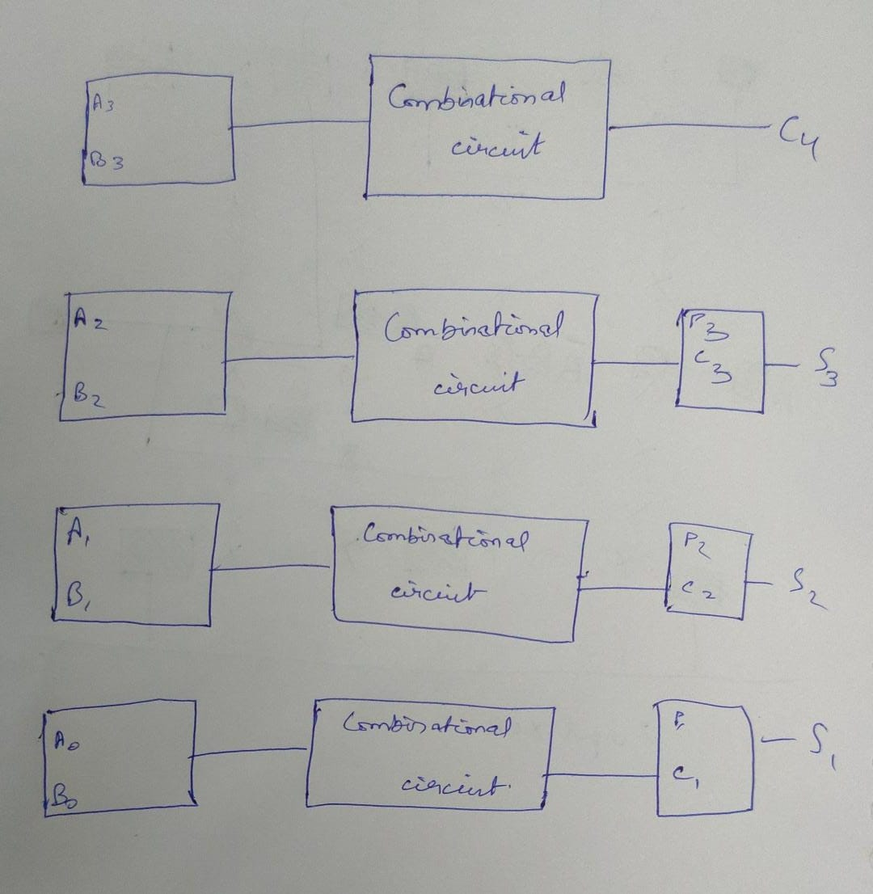

## Verilog HDL

```verilog
module carryadder(s0, s1, s2, s3, c4, c0, a0, b0, a1, b1, a2, b2, a3, b3);

// Defining the inputs, outputs and wires of the carryadder
input c0, a0, b0, a1, b1, a2, b2, a3, b3;
output s0, s1, s2, s3, c4;

wire p0, g0, p1, g1, p2, g2, p3, g3, t1, t2, t3, t4,
    t5, t6, t7, t8, t9, t10, t11, t12, t13, t14, t15, t16;


// Defining the carryadder logic in blocks

// First, the carry-propogate and carry-generate block of the carryadder

// First digits
xor G1(p0, a0, b0);
and G2(g0, a0, b0);

// Second digits
xor G3(p1, a1, b1);
and G4(g1, a1, b1);

// Third digits
xor G5(p2, a2, b2);
and G6(g2, a2, b2);

// Fourth digits
xor G7(p3, a3, b3);
and G8(g3, a3, b3);

// Then, the carry-lookahead generator block of the carryadder

// C1
and G9(t1, p0, c0);
or G10(c1, g0, t1);

// C2
and G11(t2, p0, p1, c0);
and G12(t3, g0, p1);
or G13(t4, t3, G1);
or G14(c2, t2, t4);

// C3
and G15(t5, p0, p1, p2, c0);
and G16(t6, g0, p1, p2);
and G17(t7, g1, p2);
or G18(t8, g2, t7);
or G19(t9, t6, t8);
or G20(c3, t5, t9);

// C4
and G21(t10, p0, p1, p2, p3, c0);
and G22(t11, g0, p1, p2, p3);
and G23(t12, g1, p2, p3);
and G24(t13, g2, p3);
or G25(t14, g3, t13);
or G26(t15, t12, t14);
or G27(t16, t11, t15);
or G28(c4, t10, t16);

// Then the sum block of the carryadder

// S0
xor G29(s0, p0, c0);

// S1
xor G30(s1, p1, c1);

// S2
xor G31(s2, p2, c2);

// S3
xor G32(s3, p3, c3);

endmodule
```

```verilog
module testbench_cla;

reg c0, a0, b0, a1, b1, a2, b2, a3, b3;
wire s0, s1, s2, s3, c4;

carryadder test(s0, s1, s2, s3, c4, c0, a0, b0, a1, b1, a2, b2, a3, b3);

initial begin
    $dumpfile("test.vcd");
    $dumpvars(0, testbench_cla);
    $monitor($time, " c0 = %b, a0 = %b, b0 = %b, a1 = %b, b1 = %b, a2 = %b, b2 = %b, a3 = %b, b3 = %b",
    c0, a0, b0, a1, b1, a2, b2, a3, b3);

    c0 = 1'b0;
    a0 = 1'b0;
    b0 = 1'b0;
    a1 = 1'b0;
    b1 = 1'b0;
    a2 = 1'b0;
    b2 = 1'b0;
    a3 = 1'b0;
    b3 = 1'b0;

    #2560 $finish;

end

always #5 a0 = ~a0;
always #10 b0 = ~b0;
always #20 a1 = ~a1;
always #40 b1 = ~b1;
always #80 a2 = ~a2;
always #160 b2 = ~b2;
always #320 a3 = ~a3;
always #640 b3 = ~b3;
always #1280 c0 = ~c0;

endmodule
```

Since the waveform is very long, spanning over 2560 units of time, the plot has not been attached in the report. The same can be obtained by running the above two files using the following line in command prompt:

`iverilog <name-of-first-file.v> <name-of-second-file.v>`

A sample waveform is attached here:

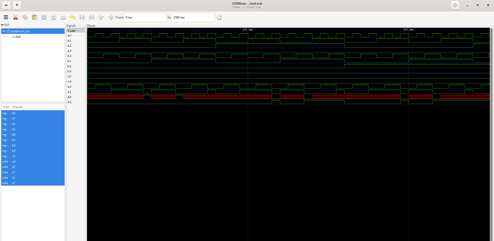

